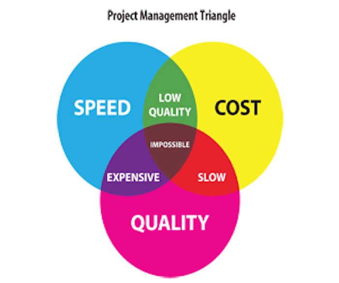
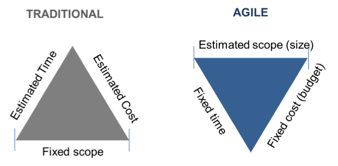
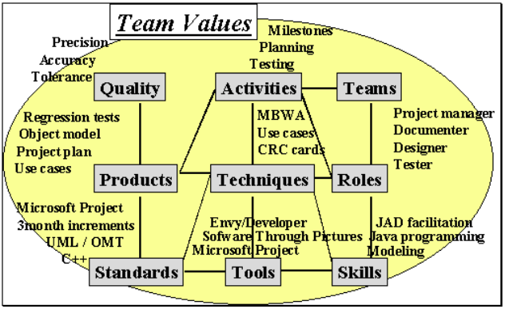

# Введение в Agile Development

Кирилл Корняков\
Сентябрь 2018

<!--
TODO
  - Несколько раз повторяется одно и то же (основные черты)
  - # Итеративная модель: , или можно вставить Scrum Sprint
  - Переписать раздел с основыми чертами
-->

# Содержание

  - Agile сегодня
  - История и предпосылки возникновения
  - Общая характеристика Agile

# Agile Development

  - Семейство методологий разработки
  - Относительно молодое
    - Отдельные методологии появились в середине 90х
    - Получили широкое распространение в 2000х
  - Очень успешное и популярное
    - Применяется практически всеми ведущими компаниями
    - Фактически стали мейнстримом в разработке ПО
  - Весьма интересное
    - "Изобретены" программистами
    - Легковесные практики

# Центральная идея

  - Метафора с угадыванием числа

# Центральная идея

+-----------------------------+------------------------------------------------+
|  | Фокус на адаптируемости вместо предсказуемости |
|                             |                                                |
|                             | > - Небольшие и частые релизы                  |
|                             |   - Непрерывное улучшение                      |
|                             |   - Готовность к изменениям                    |
|                             |   - Самоорганизующиеся команды                 |
+-----------------------------+------------------------------------------------+

# Современное состояние

  - Огромная масса небольших и средних проектов выполняется согласно гибким
    методологиям.
  - В том числе в крупных компаниях:
    - Intel (XP, Scrum)
    - Microsoft (Agile MSF)
    - Google (Scrum)
    - IBM
  - Имеются успешные опыты внедрения гибких методологий в крупных и
    распределенных проектах.
  - _Отдельные практики гибких методологий проникли во все другие методологии._

# Темпы внедрения Agile

Copyright 2008, Scott W. Ambler (<http://www.ambysoft.com/surveys/>)

# Как изменилось качество ПО после внедрения Agile

Copyright 2008, Scott W. Ambler (<http://www.ambysoft.com/surveys/>)

# Содержание

  - Agile сегодня
  - История и предпосылки возникновения
  - Общая характеристика Agile

# Предпосылки и история

  - Первый кризис программирования
    - Стоимость ПО обгоняет стоимость аппаратуры
  - Сложность разработки ПО:
    - Сложность решаемых задач
    - Техническая сложность разработки
    - Сложность организации процесса разработки
  - Рождение __Программной инженерии__, направленной на сокращение стоимости ПО

# Каскадная модель

  - Основа модели — сформулированные требования (ТЗ)
  - Критерий качества — соответствие ТЗ
  - Каждая фаза начинается после завершения предыдущей
  - Каждая фаза полностью документируется

# Стоимость внесения изменений

# Стоимость внесения изменений

# Продолжение кризиса

Ряд проблем был снят, но кризис продолжался...

  - Поиски серебряной пули
    - Фредерик Брукс _"Мифический человеко-месяц"_, 1975
    - Chap. 16. "No Silver Bullet — Essence and Accident", 1987
    - Chap. 17. "'No Silver Bullet' Refired", 1995

# Технологические способы решения

  - Модульное программирование
  - Структурное программирование
  - ООП
  - Паттерны
  - Более совершенные языки и технологии
  - Инструментальная поддержка разработки (CASE)

# Методология разработки

> __Методология программирования__ — совокупность методов, применяемых на
различных стадиях жизненного цикла программного обеспечения и имеющих общий
философский подход.

Каждая методология характеризуется своим:

  - Философским подходом или основными _принципами_. Эти принципы, от которых
    зависит эффективность всей методологии, обычно можно кратко сформулировать и
    легко объяснить;
  - Согласованным множеством моделей _методов_, которые реализуют данную
    методологию;
  - _Концепциями_ (понятиями), позволяющими более точно определить методы.

# Методология разработки

Включает ряд дисциплин, например такие как:

+------------------------+------------------------------+
| - управление проектами | - написание кода             |
| - анализ требований    | - интеграция и тестирование  |
| - проектирование       | - контроль качества          |
+------------------------+------------------------------+

# Методологии разработки

Проекты отличаются по масштабам, бюджету, срокам, сложности и критичности.

В настоящее время существует огромное разнообразие методологий:

  - ISO
  - CMM, CMMI
  - MSF - Microsoft Solution Framework
  - RUP - Rational Unified Process
  - Agile Methodologies

__Нет методологии, подходящей сразу для всех проектов.__

# Ниша Agile

> Экстремальное программирование — это __упрощенная__ методика организации
производства для __небольших и средних по размеру команд__ специалистов,
занимающихся разработкой программного продукта в условиях __неясных или быстро
меняющихся__ требований.

Кент Бек, Экстремальное программирование

# Agile Methodologies

  - [Scrum](http://en.wikipedia.org/wiki/Scrum_(development))
  - [Extreme Programming (XP)](http://en.wikipedia.org/wiki/Extreme_Programming)
  - [Kanban (development)](http://en.wikipedia.org/wiki/Kanban_(development))
  - [Lean software development](http://en.wikipedia.org/wiki/Lean_software_development)
  - Crystal Clear
  - Agile Unified Process (AUP)
  - Essential Unified Process (EssUP)
  - Open Unified Process (OpenUP)
  - Dynamic Systems Development Method (DSDM)
  - Feature Driven Development (FDD)
  - GSD
  - Velocity tracking

# Agile Methodology Most Closely Followed

# Содержание

  - Agile сегодня
  - История и предпосылки возникновения
  - Общая характеристика Agile

# Agile Manifesto (2001)

We are uncovering better ways of developing
software by doing it and helping others do it.
Through this work we have come to value:

+--------------------------------+------+---------------------------------+
| - Individuals and interactions | over | - Processes and tools           |
| - Working software             |      | - Comprehensive documentation   |
| - Customer collaboration       |      | - Contract negotiation          |
| - Responding to change         |      | - Following a plan              |
+--------------------------------+------+---------------------------------+

That is, while there is value in the items on the right,\
we value the items on the left more.

# Project Management Triangle

+-------------------------------+----------------------------------------------------------+
|  | > - "Быстро, дешево, качественно — выбери любые два."    |
|                               |   - Заказчик определяет значения только двух переменных, |
|                               |     величину третьей определяет команда разработчиков.   |
+-------------------------------+----------------------------------------------------------+

# Scope

  - Понятие Quality расщепляется на два
    - Quality как надежность, устойчивость, корректность
    - Scope — функциональность, богатство возможностей

> - Time, Cost, Quality фиксируются.
  - Scope корректируется с учетом обстоятельств.
  - Самое важное в первую очередь!

# Twelve Principles of Agile Software

 - Our highest priority is to satisfy the customer through early and continuous
   delivery of valuable software.
 - Welcome changing requirements, even late in development. Agile processes
   harness change for the customer's competitive advantage.
 - Deliver working software frequently, from a couple of weeks to a couple of
   months, with a preference to the shorter timescale.
 - Business people and developers must work together daily throughout the
   project.
 - Build projects around motivated individuals. Give them the environment and
   support they need, and trust them to get the job done.
 - The most efficient and effective method of conveying information to and
   within a development team is face-to-face conversation.

# Twelve Principles of Agile Software

 - Working software is the primary measure of progress.
 - Agile processes promote sustainable development. The sponsors, developers,
   and users should be able to maintain a constant pace indefinitely.
 - Continuous attention to technical excellence and good design enhances
   agility.
 - Simplicity — the art of maximizing the amount of work not done — is essential.
 - The best architectures, requirements, and designs emerge from self-organizing
   teams.
 - At regular intervals, the team reflects on how to become more effective, then
   tunes and adjusts its behavior accordingly.

# Основные черты: Итеративный процесс

  - Выпуск новой версии как минимум каждые 2-4 недели
  - На выходе каждой итерации — __рабочий продукт__
  - Минимум необходимого
    - Планирования
    - Проектирования
    - Документации

# Основные черты: Команды разработчиков

  - Самостоятельно организуют свою работу
  - Располагаются в общем открытом офисе
  - Ежедневные stand-up meeting
  - Тесная связь с заказчиком

# Основные черты: Отношение к документам

  - Личное общение предпочитается письменным документам
      - Общение с заказчиком
      - Общение внутри команды
  - Документация либо не пишется совсем, либо необходимый минимум

<!-- Once you realize that documentation should be laughed at, peed upon, put on fire, and just ridiculed in general, THEN, and only then, have you reached the level where you can safely read it and try to use it to actually implement a driver.

    Torvalds, Linus (2001-01-12). Re: ide.2.4.1-p3.01112001.patch. Retrieved on 2012-06-22.
-->

# Препятствия при внедрении гибких методик

  - Выполнение типовых проектов
  - Большие команды разработчиков (более 20)
  - Распределенные команды разработчиков
  - Культура управления в компании (все менее актуально)

# Резюме: сравнение характерных черт

+------------------------------------+---------------------------------+
| Методики с четким планированием    | Гибкие методики                 |
+====================================+=================================+
| - Требования фиксированы           | - Частая смена требований       |
| - Типовые проекты                  | - Уникальные продукты           |
| - Крупные проекты                  | - Небольшие и средние проекты   |
| - Большое количество разработчиков | - Небольшое число разработчиков |
| - Высокие риски                    | - Средние риски                 |
+------------------------------------+---------------------------------+

# Ключевые моменты

  - Классические методологии были нацелены в первую очередь на масштабные
    проекты с высокой критичностью. Отсюда ориентация на строгое планирование и
    ведение подробной документации.
  - Однако большинство современных проектов относительно небольшие, и требования
    являются неясными или быстро меняющимися. Это привело к возникновению и
    распространению ГТР.
  - Agile ориентирован на адаптивность вместо предсказуемости. Это частые
    релизы, самоорганизующиеся команды профессионалов-универсалов, минимальный
    накладной расход на ведение процесса.
  - Agile методологии имеют свои ограничения, однако их практики показали
    высокую эффективность и на сегодняшний день применяются практически в любых
    проектах.

# Контрольные вопросы

  1. Понятия содержания и охвата методологии
  1. Приведите различные закономерности, объединяющие размер команды, методологии и сложность решаемой проблемы
  1. Какие факторы повлияли на содержание первых методологий разработки
  1. Достоинства и недостатки каскадной модели
  1. Определение методологии программирования
  1. Определение ГТР (на примере XP)
  1. Манифест ГТР
  1. Приведите 3-4 принципа ГТР
  1. Основные черты ГТР
  1. Факторы, противодействующие внедрению ГТР

# Ссылки

    1. http://alistair.cockburn.us/Methodology+per+project
    1. http://www.crisp.se/henrik.kniberg/Kanban-vs-Scrum.pdf
    1. http://en.wikipedia.org/wiki/Software_development_process

# Спасибо за внимание!

Вопросы?

# Тест Джоэла

1. Пользуетесь ли вы системой контроля версий?
1. Можете ли вы собрать продукт за один шаг?
1. Выполняете ли вы ежедневные билды?
1. Используете ли вы базу данных ошибок?
1. Исправляете ли вы ошибки перед написанием нового кода?
1. Есть ли у вас актуальный план работ?
1. Есть ли у вас спецификация?
1. Предоставлены ли вашим программистам спокойные условия для работы?
1. Используете ли вы новейшие и лучшие инструменты?
1. Есть ли у вас тестеры?
1. Пишут ли кандидаты на работу код во время собеседования?
1. Проводите ли вы коридорное тестирование удобства использования программ?

# 7 properties of highly successful projects from Crystal Clear

1. Frequent delivery
1. Reflective improvement
1. Close communication
1. Personal safety
1. Focus
1. Easy access to expert users
1. A good technical environment

# Книги

1. Стив Макконнелл "Совершенный код"
1. Роберт Мартин Гибкая разработка ПО
1. Мифический человекомесяц http://www.ozon.ru/context/detail/id/83760/
1. Правила разработки ПО http://www.ozon.ru/context/detail/id/3163596/
1. Человеческий фактор http://www.ozon.ru/context/detail/id/2338486/
1. Экстремальное программирование http://www.ozon.ru/context/detail/id/1099618/
1. Scrum http://www.ozon.ru/context/detail/id/6241964/

# Часть первая: вводная

Software Development: Art, Craft, or Science?

# Немного истории

Кто был первыми программистами, и на кого они работали?

# Немного истории

Факторы, оказавшие влияние на Программную инженерию:
    - Другие инженерии
    - Строительство
    - Механика
    - Электроника

Особенности первых проектов
    - Критичность
    - Масштабность

# Часть вторая: молоток

> "Тот, кто хорошо владеет молотком, везде склонен видеть гвозди"

Абрахам Маслоу

# Содержание методологии

Охват методологии

Основной тезис

Эффективность методологии

Эффективность общения

Сколько нужно людей?

С чем справится команда?

Как подобрать методологию?

Scrum
