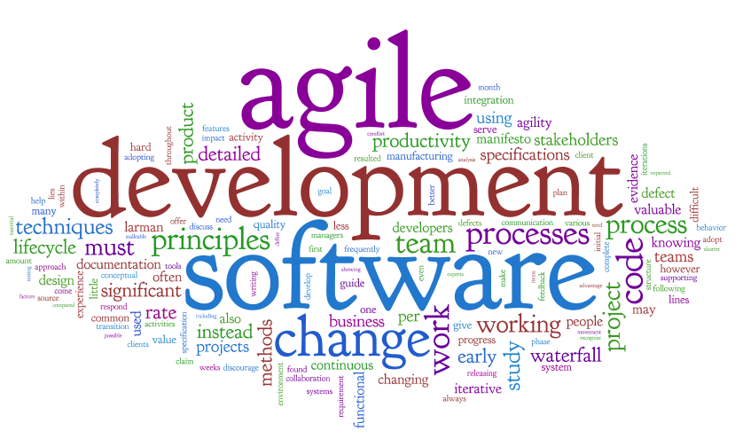

# Введение в Agile Development

Кирилл Корняков\
Сентябрь 2013

# Содержание

  * Agile сегодня
  * История и предпосылки возникновения
  * Общая характеристика Agile

# Agile

**Agile Development**

* Относительно молодое семейство методологий разработки
* Важной особенностью является то, что они "изобретены" программистами
* Включает как организационные, так и технические практики (методики, техники)
* Фокус на адаптируемости вместо предсказуемости

# Современное состояние

Сегодня можно говорить о том, что Agile практики стали мейнстримом в разработке ПО.

  * Огромная масса небольших и средних проектов выполняется согласно гибким
    методологиям.
  * В том числе в крупных компаниях:
    - Intel (XP, Scrum)
    - Microsoft (Agile MSF)
    - Google (Scrum)
    - IBM
  * Имеются успешные опыты внедрения гибких методологий в крупных и
    распределенных проектах.
  * _Отдельные практики гибких методологий проникли во все другие методологии._

# Скорость восприятия Agile

Copyright 2008, Scott W. Ambler (www.ambysoft.com/surveys/)

# Как изменилось качество ПО после применения Agile

Copyright 2008, Scott W. Ambler (www.ambysoft.com/surveys/)

# Содержание

  * Agile сегодня
  * История и предпосылки возникновения
  * Общая характеристика Agile

# Предпосылки и история

  * Первый кризис программирования
    - Стоимость ПО обгоняет стоимость аппаратуры
    - Рождение **программной инженерии**, направленной на сокращение стоимости ПО
  * Продолжение кризиса

# Предпосылки и история

  * Сложность разработки ПО:
    - Сложность решаемых задач
    - Техническая сложность разработки
    - Сложность организации процесса разработки
  * Поиски серебряной пули
    - Фредерик Брукс _"Мифический человеко-месяц"_, 1975
    - Chap. 16. "No Silver Bullet — Essence and Accident", 1987
    - Chap. 17. "'No Silver Bullet' Refired", 1995

# Предпосылки и история

  * Технологические способы решения:
    - Модульное программирование
    - Структурное программирование
    - ООП
    - Паттерны
    - Более совершенные языки и технологии
    - Инструментальная поддержка разработки (CASE)

# Методология разработки

  * Нетехнологические способы решения:
    - Практики
    - Методологии разработки ПО

**Методология разработки** – описание того, как в целом организована разработка ПО.

Включает дисциплины:

+------------------------+------------------------------+
| * управление проектами | * написание кода             |
| * анализ требований    | * интеграция и тестирование  |
| * проектирование       | * контроль качества          |
+------------------------+------------------------------+

# Методологии разработки
Проекты отличаются по масштабам, бюджету, срокам, сложности и критичности.
Нет методологии, подходящей сразу для всех проектов.

  * MSF - Microsoft Solution Framework
  * RUP - Rational Unified Process

**Agile**

  * eXtreme Programming
  * Scrum
  * Lean software development (Kanban)
  * Agile MSF, Agile RUP

# Каскадная модель

  * Основа модели – сформулированные требования (ТЗ)
  * Критерий качества – соответствие ТЗ
  * Каждая фаза начинается после завершения предыдущей
  * Каждая фаза полностью документируется

# Стоимость внесения изменений

# Стоимость внесения изменений

# Итеративная модель

# Ниша Agile

> Экстремальное программирование — это __упрощенная__ методика организации
производства для __небольших и средних по размеру команд__ специалистов,
занимающихся разработкой программного продукта в условиях __неясных или быстро
меняющихся__ требований.

Кент Бек, Экстремальное программирование

# Agile Methodologies
  * [Scrum](http://en.wikipedia.org/wiki/Scrum_(development))
  * [Extreme Programming (XP)](http://en.wikipedia.org/wiki/Extreme_Programming)
  * [Kanban (development)](http://en.wikipedia.org/wiki/Kanban_(development))
  * [Lean software development](http://en.wikipedia.org/wiki/Lean_software_development)
  * Crystal Clear
  * Agile Unified Process (AUP)
  * Essential Unified Process (EssUP)
  * Open Unified Process (OpenUP)
  * Dynamic Systems Development Method (DSDM)
  * Feature Driven Development (FDD)
  * GSD
  * Velocity tracking

# Agile Methodology Most Closely Followed

# Содержание

  * Agile сегодня
  * История и предпосылки возникновения
  * Общая характеристика Agile

# Гибкие методологии

* Особенность гибких (agile) методологий – ориентация на **адаптивность** вместо
  предсказуемости.

# Agile Manifesto (2001)

+--------------------------------+------+---------------------------------+
| * Individuals and interactions | over | * Processes and tools           |
| * Working software             |      | * Comprehensive documentation   |
| * Customer collaboration       |      | * Contract negotiation          |
| * Responding to change         |      | * Following a plan              |
+--------------------------------+------+---------------------------------+

That is, while there is value in the items on the right, we value the items on
the left more.

# Major Principles of Agile Software

  * Working software is the primary measure of progress.
  * Simplicity – the art of maximizing the amount of work not done.
  * The most efficient and effective method of conveying information to and
    within a development team is face-to-face conversation.
  * The best architectures, requirements, and designs emerge from self-
    organizing teams.
  * At regular intervals, the team reflects on how to become more effective,
    then tunes and adjusts its behavior accordingly.

# 4 переменные

Заказчик определяет значения только двух переменных,
величину третьей определяет команда разработчиков.

# 4 переменные

  * Первые три переменные фиксируются.
  * Scope – число функций системы.
  * Scope корректируется с учетом обстоятельств.
  * Самое важное в первую очередь!

# Основные черты

**Итеративный процесс**

  - 2-4 недели
  - На выходе каждой итерации – рабочий продукт
  - Минимум необходимого
      - Планирования
      - Проектирования
      - Документации

# Основные черты

**Команды разработчиков**

  - Самостоятельно организуют свою работу
  - Располагаются в общем открытом офисе
  - Ежедневные stand-up meeting
  - Тесная связь с заказчиком

# Основные черты

**Отношение к документам**

  - Личное общение предпочитается письменным документам
      - Общение с заказчиком
      - Общение внутри команды
  - Документация либо не пишется совсем, либо необходимый минимум

# Сравнение основ

+------------------------------------+--------------------------------------+
| **Гибкие методики**                | **Методики с четким планированием**  |
|                                    |                                      |
|   - Частая смена требований        |   - Требования фиксированы           |
|   - Небольшое число разработчиков  |   - Большое количество разработчиков |
|   - Небольшие и средние проекты    |   - Крупные проекты                  |
+------------------------------------+--------------------------------------+

# Препятствия при внедрения гибких методик:

  - Большие команды разработчиков (более 20)
  - Распределенные команды разработчиков
  - Выполнение типовых проектов
  - Культура управления в компании

# Контрольные вопросы

  1. Какие факторы повлияли на содержание первых методологий разработки
  1. Достоинства и недостатки каскадной модели
  1. Манифест ГТР
  1. Определение ГТР
  1. Основные черты гибких методологий разработки
  1. Факторы, противодействующие внедрению ГТР

# Спасибо за внимание!
  * Вопросы?
