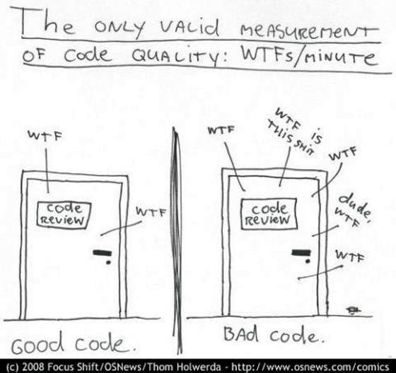

# Clean Code

Евгений Сорокин,
Кирилл Корняков

Сентябрь 2013

<!-- TOOD

 - Вставить пример на полиморфизм с камерой
 - Уточнить пример с булевским флагом
 - Идеальный код, ИКР, примеры
 - Зачем писать код: чтобы быстро разбираться и фиксить проблемы,
   когда это нужно будет сделать срочно
-->

# Содержание

  * Зачем?
  * Ключевые понятия
  * Чистый код
    - наименование
    - функции/методы
    - коментарии
    - форматирование
    - юнит тесты
  * Заключение

# Зачем?

> "Зачем? Наши клиенты не смотрят на исходный код. Почему мы должны держать его в чистоте?."

  Генеральный директор компании по разработке ПО,
  Нижний Новгород, Август 2010

# Что такое качество кода?



# Ключевые понятия

 - Дублирование
 - Шум
 - Единообразие (единый стиль)
 - Принцип единой ответственности
 - Ортогональность
 - Уровни абстракции

# Основные принципы

Код должен быть простым и понятным с первого взгляда!

* DRY: Don't repeat yourself
* KISS: keep it simple, stupid
* Say what you mean, simply and directly.
* Write clearly - don't be too cleaver.
* Write clearly - don't sacrifice clarity for "efficiency".

# Именование

# Именование типов

<font face="Courier New">
public class IncompleteOrder {} \
public int currentPosition = -1; \
private bool isBlocked // can, is, hass  \ \ \

<font color=red>
public class incompleteOrder {} \
private bool Blocked \

public const int NUMBEROFCONTEXTS = 10; \
private int collectionsize; \
private string m_strName; \
private byte _array; \
</font>
</font>

# Аббревиатуры

<font face="Courier New">
int firstValidInvoicePosition; \
private string DBProvider; \
private string SqlStatement; \
string orderId; \ \

<font color=red>
int fstIvPos; \
private IConnection ODBCConnection; \
string deliveryNoteId; \
</font>
</font>

# Классы и методы

<font face="Courier New">
<font color=red>
  private bool Blocked
</font>

<font color=green>
  private bool isBlocked
</font>
</font>


``` java
public PayableOrder FindById(InternalKey id)
```

# Паттерн "Команда"

``` java
    var commands = new List<ICommand> {
       new CompareImages(diff4Big),
       new ExcludeFailedContainers(),
       new ReportResults()
    };

    var data = new ExperimentalData();
    foreach (var command in commands) {
       command.Run(data);
    }
```

# Наследованные классы

``` java
public class SpecializedAttribute : Attribute {}
public class CustomerCollection : CollectionsBase {}
```

Это соответствует проверке "Is A".

# Контекст


<font face="Courier New">
<font color=red>
  customer.CustomerName \
  customer.CustomerAddress
</font>

<font color=green>
  customer.Name
</font>
 \
 \
Application "Gas Station Deluxe"
 \
<font color=red>
  GSDAccountAddress
</font>


</font>


# Magic numbers

Не используйте их!

``` java
    int dailyPay = hourlyRate * 8;
    double milesWalked = feetWalked / 5280;
    int step = width * 4;
```

Используйте:

> - `WORK_HOURS_PER_DAY`
  - `FEET_PER_MILE`
  - `sizeof(int)`

# Имена

* Хорошие имена => самодокументированный код
* Плохие имена <= Вы не понимаете предметную область вашего приложения

``` java
void DoStuff();
void SpecificMethod1();
List<PECustomerDetailsData> RetrieveValidateAndConvertCustomerSpecificDataIntoPresentationEntities();
```

# Функции

Какова нормальная длина функции?

<!-- TBD: вставить оригинальную картинку -->

``` c
    {
      {
        while (.. ){
          if (..){
              }
          for (.. ){
              }
             .... (just putting in the control flow here, imagine another few hundred ifs)
          if(..)   {
                if(..)     {
                       if(..)   {
                    ...
                    (another few hundred brackets)
                           }
                      }
             } //endif
```

  * The endif showed up around line 800)

# Оптимальное количество параметров функции

``` cpp
    int OverlayFlatVideos(int numberOfFlatVideos,
                          int currentFrameIdx,
                          OverlayAllVideosParams^ previewParams,
                          std::vector<bool>& StreamProcessed,
                          std::vector<acvCapture*>& flatVideoReaders,
                          std::vector<double>& fpsFlatVideos,
                          bool sharedReflection,
                          std::vector<CvMat*>& reflectionsFlatToDome,
                          CvSize& fullDomeSize,
                          std::vector<IplImage*>& masks,
                          std::vector<IplImage*>& borderSmoothImage,
                          CvSize& maskSize,
                          IplImage*& imageFullDome,
                          CvMat*& tempRef,
                          double fps,
                          int& numberOfVideoReaders,
                          IplImage*& imageReflected,
                          IplImage*& imageFullDomeCopy,
                          InterpolationMethod inMethod)
```

# Функции

``` java
    public ComplexNumber Add(ComplexNumber summand){
      var real = this.Real + summand.Real;
      var imaginary = Imaginary + summand.Imaginary;
      return new ComplexNumber(real, imaginary);
    }

    public void Add(OrderItem item){
      items.Add(item);
    }
```

# Функции

``` java
    public List<Document> GetDocuments(Customer customer);
    public List<Customer> FetchCustomers();
    public List<Order> RetrieveOrders();
    public List<CustomerData> LoadDetails(Customer customer);
```

# Флаги - как параметры

``` java
    public FileStream Open(string path, bool readOnly) {
    //...
    }
```

# Выходные параметры

``` java
    public static
    void GetSupportDocFilePath(out string supportDocFilePath) {
        supportDocFilePath = new ConfigurationHelper().SupportFilePath;
    }

    public static string GetSupportDocFilePath() {
        return new ConfigurationHelper().SupportFilePath;
    }
```

# Убийственная сложность

``` c
float _______ ( float number )
{
  long i;
  float x2, y;
  const float threehalfs = 1.5F;

  x2 = number * 0.5F;
  y  = number;
  i  = * ( long * ) &y;                       // evil floating point bit level hacking
  i  = 0x5f3759df - ( i >> 1 );               // what the fuck?
  y  = * ( float * ) &i;
  y  = y * ( threehalfs - ( x2 * y * y ) );   // 1st iteration
//      y  = y * ( threehalfs - ( x2 * y * y ) );   // 2nd iteration, this can be removed
  return y;
}
```

ftp://ftp.idsoftware.com/idstuff/source/quake3-1.32b-source.zip

# Условия

``` java
    if (splitParameters->projectorVideos == nullptr ||
    System::String::IsNullOrEmpty(splitParameters->splitSettings) ||
    splitParameters->projectorWidth <= 0 ||
    splitParameters->projectorHeight <= 0) {}

    if (timer.HasExpired() && !timer.IsRecurrent()) {}
    if (ShouldBeDeleted(timer)) {}

    if(isValid == false) {}
    if(!canEditPrice) {}
```

# Избегайте коды ошибок

``` java
    public void SendShutDown() {
        var handle = GetHandle(device);
        if (handle != DeviceHandle.INVALID) {
            ...
        }
        else {
            Logger.Log("Invalid handle for: " +
            device.ToSting());
        }
    }
```

# Только одна операция !!!

``` java
    public void SendShutDown() {
        try {
            TryToShutDown();
        }
        catch (DeviceShutDownError e) {
            logger.Log(e);
        }
    }
    private void TryToShutDown() {
        var handle = GetHandle(device);
        ...
    }
```

# Мертвый код

``` java
public static bool IsAccountNameExists() {
  return IsAccountNameExists();
}
```

# Функции: резюме

> "Functions should do one thing.
   They should do it well.
   They should do it only."

Robert Martin

# Комментарии


# Комментарии

    // When I wrote this, only God and I understood what I was doing
    // Now, God only knows

    ...

    // Magic. Do not touch.

    ...

    // sometimes I believe compiler ignores all my comments

    ...

    // I'm sorry.

    ...

    //This code sucks, you know it and I know it.
    //Move on and call me an idiot later.

    ...

    // I am not sure if we need this, but too scared to delete.

``` java
Catch (Exception e) {
    //who cares?
}
```

# Комментарии

Они полезны?

  * Неактуальная информация
  * Устаревшие комментарий
  * Избыточный комментарий
  * Плохой комментарий
  * Закоментированный код
  * Дезинформация

# Неактуальная информация, Большой header

``` java
    /*---------------------------------------------------------------
    -----------------------
    Created by: NANDA
    Created Date: 01-AUG-2009
    Modified by:
    Procedure Description: Fetches menu items based on the given
    user permission
    Input Parameters: LoginEntry user
    Output Parameters: none
    ----------------------------------------------------------------
    --------------------*/
    public BEMenuList FetchMenuItems(LoginEntity user) {
    ...
    }
```

# Устаревший комментарий

``` java
    ...
    // Gets the login user id
    // Gets the CRM details
    FetchCrmDetails();
    ...
```

# Избыточный комментарий

``` java
    // If the server variable is empty, throw the error message
    if (loginUserId == null)
    {
        throw new Exception(“No User Id”);
    }
```

# Плохой комментарий

``` java
    public void LoadProperties() {
        try
        {
            var propertiesPath = propertiesLocation +
            "/" + PROPERTIES_FILE;
            var propertiesStream = File.Open(propertiesPath);
            loadedProperties.Load(propertiesStream);
        }
        catch (IOException ex) {
            //If file with properties doesn’t exist,
            //default settings are loaded
        }
    }
```

# Закоментированный код

``` java
//#region ShowHyperLink
///// <summary>
///// Show the hyperlink controls
///// </summary>
//private void ShowHyperLink()
//{
//  asphypCreateAccounts.Visible = true;
//  asphypCreateAccounts.NavigateUrl = "CreateAccount.aspx";
//  asphypCreateAccounts.Text = WebConstants.CreateAccountHyperLink;
//  asphypCreateExtUser.Visible = true;
//  asphypCreateExtUser.NavigateUrl = "ManageExternalUsers.aspx";
//  asphypCreateExtUser.Text = WebConstants.ExternalUserHyperLink;
//}
//#endregion
```

# Еще хуже

``` java
asplblAcceptDeclineDate.Text = contractHistoryList[0].AcceptedDate.ToString();
if (contractHistoryList[0].IsMultiple)
{
    asplblMultiplePublish.Text = "Yes";
}
else
{
    asplblMultiplePublish.Text = "No";
}
//if (contractHistoryList[0].IsLegalApprovalRequierd == true)
//{
//  asplblLegalApproval.Text = "Yes";
//}
//else
//{
//  asplblLegalApproval.Text = "No";
//}
asphdnFileGuid.Value = contractHistoryList[0].FileGuid.ToString();
//int contractRefNo = Convert.ToInt32(asphdnFileMasterld.Value.ToString());
//Session(WebConstants.CONTRACT_REF_NO_SESSION_KEY] = contractRefNo;
asptxtReasonForRejection.Text = string.Empty;
```

# Дезинформация

* Never rely on a comment ...

``` java
/**
 * Always returns true.
 */
public boolean isAvailable()
{
    return false;
}
```


# Позволительные комментарии

* Пояснения в **нетривиальных** случаях

```
// format matched kk:mm:ss EEE, MMM dd, yyyy
Pattern timeMatcher = Pattern.Compile("\\d*:\\d*:\\d* \\w*, \\w* \\d*, \\d*");
```

* Заметки разработчика (желательно избегать)

```
    //TODO: ...
    //FIXME: ...
    //HACK, NOTE, WARNING
```

* API (doxygen)

# Комментарии: резюме

> "Don’t comment bad code — rewrite it!"

B. Kernighan, P. Plauger
The Elements of Programming Style

# Форматирование

# Horizontal spacing
``` java
customer.CalculateCredit ( fromDate );
customer.CalculateCredit(fromDate , toDate);
if ( IsValid ) i ++
```

``` java
if(customer.IsValid && customer.Credit == 0.0)
position = new Location(position.x + 10, position.y);
Return IsValid ? cdd : DateTime.MaxDate;
```

# Vertical spacing

``` java
using MVCS.Diff4Big.Domain.ImageEntities;
using MVCS.Diff4Big.Domain.Specifications;
namespace MVCS.Diff4Big.Domain.Comparison.FT {
    public class ByteByByte : ITileComparator {
        private readonly LengthBased lengthBased = new LengthBased();
        public IDeltaContainer Compare(IContentTile tile1, IContentTile tile2, ChangeType changeType) {
            var bytesRangeEqualsSpecification = new BytesRangeEquals(tile1.Content);
            var baseResult = lengthBased.Compare(tile1, tile2, changeType);
            if (baseResult != null) return baseResult;
            if (bytesRangeEqualsSpecification.IsSatisfiedBy(tile2.Content)) return null;
            if (changeType == ChangeType.ImageThematicalTile) {
                return new ThematicalTileContainer((ThematicalBig1Tile) tile2.Clone());}
            return new TileContainer((IContentTile) tile2.Clone(), changeType);
        }
    }
}
```

# Vertical spacing

``` java
using MVCS.Diff4Big.Domain.ImageEntities;
using MVCS.Diff4Big.Domain.Specifications;

namespace MVCS.Diff4Big.Domain.Comparison.FT {

    public class ByteByByte : ITileComparator {
        private readonly LengthBased lengthBased = new LengthBased();

        public IDeltaContainer Compare(IContentTile tile1, IContentTile tile2, ChangeType changeType) {
            var bytesRangeEqualsSpecification = new BytesRangeEquals(tile1.Content);

            var baseResult = lengthBased.Compare(tile1, tile2, changeType);
            if (baseResult != null) return baseResult;

            if (bytesRangeEqualsSpecification.IsSatisfiedBy(tile2.Content)) return null;

            if (changeType == ChangeType.ImageThematicalTile) {
                return new ThematicalTileContainer((ThematicalBig1Tile) tile2.Clone());
            }
            return new TileContainer((IContentTile) tile2.Clone(), changeType);
        }
    }
}
```

# unit tests

# unit tests

``` java
[TestMethod]
public void FetchUsingCreatedBySpecification() {
            var user1 = new User(new Distributor("", "2"));
            var user2 = new User(new Distributor("", "3"));
            var user3 = new User("", "3", Role.Administrator);

            var distributor1 = new Distributor { CreatedBy = user1 };
            var distributor2 = new Distributor { CreatedBy = user2 };
            var distributor3 = new Distributor { CreatedBy = user3 };

            var specification = new CreatedBy<Distributor>(user1);

            Assert.IsTrue(specification.IsSatisfiedBy(distributor1));
            Assert.IsFalse(specification.IsSatisfiedBy(distributor2));
            Assert.IsFalse(specification.IsSatisfiedBy(distributor3));
}
```

# unit tests

``` java
[TestMethod]
public void FetchUsingCreatedBySpecification() {
            var john = new User(new Distributor("", "john"));
            var mike = new User(new Distributor("", "mike"));
            var bob = new User("", "bob", Role.Administrator);

            var sonOfJohn = new Distributor {CreatedBy = john};
            var sonOfMike = new Distributor {CreatedBy = mike};
            var daughterOfBob = new Distributor {CreatedBy = bob};

            var createdByJohn = new CreatedBy<Distributor>(john);

            Assert.IsTrue(createdByJohn.IsSatisfiedBy(sonOfJohn));
            Assert.IsFalse(createdByJohn.IsSatisfiedBy(sonOfMike));
            Assert.IsFalse(createdByJohn.IsSatisfiedBy(daughterOfBob));
}
```

# unit tests

``` java
new DateTime(2009, 11, 12)

public static DateTime of2009(this double ddMM) {
   var day = (int) Math.Round(ddMM, 0);
   var month = (int) Math.Round(ddMM*100, 0) - day * 100;
   return new DateTime(2009, month, day);
}

12.11.of2009();

```

# unit tests

``` java
var customer = new Customer();
customer.Name = "Vasya Pupkin";
var order = new  Order();
order.Customer = customer;
order.Date = new DateTime(2009, 10, 11);
var orderItem = new orderItem();
orderItem.Product = new Product("Lays");
orderItem.Amount = 3;
orderItem.Price = 45.30;
order.Items.Add(orderItem);
orderItem.Product = new Product("Beer");
orderItem.Amount = 3;
orderItam.Price = 20.50;
order.Items.Add(orderItem)
```

# unit tests

``` java
var order = new  OrderBuilder()
    .WithCustomer(“Vasya Pupkin”)
    .WithDate(11.10.of2009())
    .WithLineItem()
        .WithProduct(“Lays”)
        .WithAmount(3)
        .WithPrice(45.30)
    .WithLineItem()
        .WithProduct(“Beer”)
        .WithAmount(3)
        .WithPrice(20.50)
    .GetResult();
```

# Подведение итогов

# What is good and what is bad?

* Hungary notation
* Global variables
* Code optimization
* Assembler language
* Hacks
* Comments

# Tools

* Use refactoring tools

# Boy Scout Rule

* "Always leave the campground cleaner than you found it."


# Спасибо за внимание!

Вопросы?
