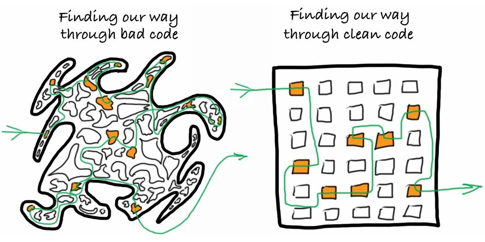

# Clean Code



Кирилл Корняков, Андрей Морозов
\
\
Сентябрь 2015

<!-- TODO

If you need more than 3 levels of indentation, you're screwed anyway, and should fix your program.
    Linux 1.3.53 CodingStyle documentation (1995). Retrieved on 2011-08-13.
You know you're brilliant, but maybe you'd like to understand what you did 2 weeks from now.
    Linux 1.3.53 CodingStyle documentation (1995). Retrieved on 2011-08-13.

Origin: https://en.wikiquote.org/wiki/Linus_Torvalds
-->

# Содержание

  - Зачем?
  - Ключевые понятия
  - Чистый код
    - Именование
    - Функции/методы
    - Комментарии
    - Форматирование
  - Заключение

# Зачем?

> Наши клиенты не смотрят на исходный код.\
Почему мы должны держать его в чистоте?

Генеральный директор компании по разработке ПО,\
Нижний Новгород, Август 2010

# Преимущества чистого кода

  - Программист в основном не пишет, а читает код
  - Быстрое понимание кода => быстрое решение задач
     - Добавление новых возможностей
     - Поиск и устранение проблем

# Откуда берется плохой код?

  - Нехватка времени
  - Отсутствие стандартов кодирования
  - Различная квалификация сотрудников
  - Низкая культура (уход от ответственности)
  - Унаследованный / сторонний код

\
Кто же виноват?

> - Руководство (заказчик, менеджер)
  - Коллеги
  - На самом деле: __Вы__!

# Как результат...


# Содержание

  - Зачем?
  - __Ключевые понятия__
  - Чистый код
    - Именование
    - Функции/методы
    - Комментарии
    - Форматирование
  - Заключение

# Что такое качество кода?


# Признаки качества кода

+-----------------------------------------+----------------------------------------------+
| ## Хорошо                               | ## Плохо                                     |
+-----------------------------------------+----------------------------------------------+
|  - Простой, логичный, понятный          |  - Непонятный, заумный, сложный              |
|  - Чистый, структурированный            |  - Запутанный, шумный, визуально нагруженный |
|  - Краткий, лаконичный                  |  - Длинный, повторяющийся                    |
|  - Единообразный (стилистически единый) |  - Беспорядочный, пестрый                    |
+-----------------------------------------+----------------------------------------------+

# Ключевые понятия

 - Дублирование (Duplication)
 - Шум (Noise)
 - Принцип единой ответственности (Single Responsibility Principle - SRP)
 - Ортогональность (Orthogonality)
 - Уровни абстракции (Levels of abstraction)
 - Единообразие (Uniformity)

# API — самое важное

  - Нужно проектировать в первую очередь
  - Уделять особое внимание при рецензии кода
  - Интерфейс должен быть понятным

```java
Matrix createMatrix(int a1, int a2);
Matrix createMatrix(int width, int height);
List<PECustomerDetailsData> retrieveValidateAndConvertCustomerSpecificDataIntoPresentationEntities();
```

  - Избегайте тавтологии

```java
customer.customerName = "Bill";
```

  - Сортируйте члены по важности для пользователя

```java
  public void do(); // up

  private int i1;   // down
```

# Содержание

  - Зачем?
  - Ключевые понятия
  - Чистый код
    - __Именование__
    - Функции/методы
    - Комментарии
    - Форматирование
  - Заключение

# Важность именования

> Программист не стал выдумывать и назвал детей\
> новый сын(1) и новый сын(2)

# Небрежное именование

Что делает следующий фрагмент?

```java
public List<int[]> getThem() {
  List<int[]> list1 = new ArrayList<int[]>();
  for (int[] x: theList) {
    if (x[0] == 4)
      list1.add(x);
  }
  return list1;
}
```

# Осмысленные имена

А теперь?

```java
public List<int[]> getFlaggedCells() {
  List<int[]> flaggedCells = new ArrayList<int[]>();
  for (int[] cell: gameBoard) {
    if (cell[STATUS_VALUE] == FLAGGED)
      flaggedCells.add(cell);
  }
  return flaggedCells;
}
```
> - Это же игра "Сапер"!

# Следим за уровнем абстракции

``` java
public List<Cell> getFlaggedCells() {
  List<Cell> flaggedCells = new ArrayList<Cell>();

  for (Cell cell: gameBoard) {
    if (cell.isFlagged()) {
      flaggedCells.add(cell);
    }
  }

  return flaggedCells;
}
```

# Сравним...

```java
public List<int[]> getThem() {
  List<int[]> list1 = new ArrayList<int[]>();
  for (int[] x: theList) {
    if (x[0] == 4)
      list1.add(x);
  }
  return list1;
}
```

``` java
public List<Cell> getFlaggedCells() {
  List<Cell> flaggedCells = new ArrayList<Cell>();

  for (Cell cell: gameBoard) {
    if (cell.isFlagged()) {
      flaggedCells.add(cell);
    }
  }

  return flaggedCells;
}
```

# Magic numbers


``` java
    int dailyPay = hourlyRate * 8;
    double milesWalked = feetWalked / 5280;
    int step = width * 4;
```

Не используйте их!

Вместо этого используйте:

> - `WORK_HOURS_PER_DAY`
  - `FEET_PER_MILE`
  - `sizeof(int)`

# Шум!

``` java
public class Part {
  private String m_dsc;
  void setName(String name) {
    m_dsc = name;
  }
}

```
\
\
\

``` java
public class Part {
  private String description;
  void setDescription(String description) {
    this.description = description;
  }
}
```

# Одно слово для каждой концепции

> - fetch, retrieve, get
  - read, load
  - controller, manager, driver

# Имена классов

> Имена классов и объектов должны представлять собой\
__существительные__ и их комбинации.

<font color=green>Хорошо</font>

 - `Customer`
 - `WikiPage`
 - `Account`

<font color=red>Плохо</font>

 - `Manager` -> `AccountManager`
 - `Processor` -> `JobProcessor`
 - `Data` -> `Order`
 - `Info` -> `HelpMessage`

# Имена методов

> Имена методов представляют собой\
__глаголы__ или глагольные словосочетания.

```java
String name = employee.getName();
customer.setName("Mike");
if (paycheck.isPosted()) ...
```


# Именование переменных и членов класса

<font color=green>Хорошо</font>

```java
public class IncompleteOrder {}
public int currentPosition = -1;
const int WORK_HOURS_PER_DAY = 8;
private bool isBlocked // can, is, has
```
\

<font color=red>Плохо</font>

``` java
public class incompleteOrder {}
private bool flag;

public const int NUMBEROFCONTEXTS = 10;
private int collectionsize;
private string m_strName;
private byte _array;
```

# Итого. Именование

 - Хорошие имена => Самодокументированный код
 - Плохие имена <= Вы не понимаете предметную область

## Советы

 - Передает назначение
 - Разумная длина
 - Легко читаются
 - Быстро вспоминаются => ищутся
 - Не содержат шум
 - Не дезинформируют

# Содержание

  - Зачем?
  - Ключевые понятия
  - Чистый код
    - Именование
    - __Функции/методы__
    - Комментарии
    - Форматирование
  - Заключение

# Функции

Какова нормальная длина функции?

In a completely uncommented 2000 line method:

```c
    {
      {
        while (..) {
          if (..){
          }

          ... (just putting in the control flow here, imagine another few hundred ifs)
          if(..) {
                if(..) {
                    if(..) {
                    ...
                    (another few hundred brackets)
                    }
                }
          } //endif
          ...
```

- The `endif` showed up around line 800!

# Оптимальное количество аргументов

``` cpp
    int OverlayFlatVideos(int numberOfFlatVideos,
                          int currentFrameIdx,
                          OverlayAllVideosParams^ previewParams,
                          std::vector<bool>& StreamProcessed,
                          std::vector<acvCapture*>& flatVideoReaders,
                          std::vector<double>& fpsFlatVideos,
                          bool sharedReflection,
                          std::vector<CvMat*>& reflectionsFlatToDome,
                          CvSize& fullDomeSize,
                          std::vector<IplImage*>& masks,
                          std::vector<IplImage*>& borderSmoothImage,
                          CvSize& maskSize,
                          IplImage*& imageFullDome,
                          CvMat*& tempRef,
                          double fps,
                          int& numberOfVideoReaders,
                          IplImage*& imageReflected,
                          IplImage*& imageFullDomeCopy,
                          InterpolationMethod inMethod) // 19
```

# WinApi C++

```cpp
        hThreadArray[i] = CreateThread(
            NULL,                   // default security attributes
            0,                      // use default stack size
            MyThreadFunction,       // thread function name
            pDataArray[i],          // argument to thread function
            0,                      // use default creation flags
            &dwThreadIdArray[i]);   // returns the thread identifier
```
\
\
\

``` cpp
    wnd.CreateWnd(hInstance, wcname, NULL, WS_VISIBLE|WS_OVERLAPPEDWINDOW,
        NWin::SRect(NWin::SPoint(CW_USEDEFAULT,CW_USEDEFAULT),
        NWin::SSize(600,400)), NULL,
        LoadMenu(hInstance, resWapp), NULL);
```

# Выходные параметры функции

``` java
    static void GetSupportDocFilePath(out string supportDocFilePath) {
        supportDocFilePath = new ConfigurationHelper().SupportFilePath;
    }

    static string GetSupportDocFilePath() {
        return new ConfigurationHelper().SupportFilePath;
    }
```

# Убийственная сложность

```c
float _______ ( float number )
{
  long i;
  float x2, y;
  const float threehalfs = 1.5F;

  x2 = number * 0.5F;
  y  = number;
  i  = * ( long * ) &y;                       // evil floating point bit level hacking
  i  = 0x5f3759df - ( i >> 1 );               // what the fuck?
  y  = * ( float * ) &i;
  y  = y * ( threehalfs - ( x2 * y * y ) );   // 1st iteration
//      y  = y * ( threehalfs - ( x2 * y * y ) );   // 2nd iteration, this can be removed
  return y;
}
```

  - Приведена оригинальная версия кода
  - <ftp://ftp.idsoftware.com/idstuff/source/quake3-1.32b-source.zip>

# Условия

```java
    if (splitParameters->projectorVideos == nullptr ||
        System::String::IsNullOrEmpty(splitParameters->splitSettings) ||
        splitParameters->projectorWidth <= 0 ||
        splitParameters->projectorHeight <= 0)

    if (timer.HasExpired() && !timer.IsRecurrent())
    if (ShouldBeDeleted(timer)) {}

    if(isValid == false) {}
    if(!canEditPrice) {}
```

# Предпочитайте исключения кодам ошибок

```java
    public void SendShutDown() {
        var handle = GetHandle(device);
        if (handle != DeviceHandle.INVALID) {
            var err = OpenDevice(handle);
            if (err == NULL) {
              //
            }
            else {
              Logger.Log("Can't open device. Error: " + err.ToSting());
            }
        }
        else {
            Logger.Log("Invalid handle for: " +
            device.ToSting());
        }
    }
```

# С использованием исключений

```java
    public void TrySendShutDown() {
        try {
          SendShutDown();
        }
        catch() {
        // ...
      }
    }

    public void SendShutDown() {
      var handle = GetHandle(device);
      OpenDevice(handle);
      //...
    }
```

# Итого. Функции

 - Оптимальная длина функции (один экран ~25-50 строк)
 - Оптимальное количество параметров
    - 0 — отлично, 1-2 — хорошо, 3 и более — ужасно
 - 0/1 выходной параметр
 - Резюме
    - Функция должна выполнять только одну операцию.
    - Она должна выполнять ее хорошо.
    - И ничего другого она делать не должна.

# Содержание

  - Зачем?
  - Ключевые понятия
  - Чистый код
    - Именование
    - Функции/методы
    - __Комментарии__
    - Форматирование
  - Заключение

# Комментарии

```java
    // When I wrote this, only God and I understood what I was doing
    // Now, God only knows

    ...

    // Magic. Do not touch.

    ...

    // sometimes I believe compiler ignores all my comments

    ...

    // I'm sorry.

    ...

    // I am not sure if we need this, but too scared to delete.
```

```java
catch (Exception e) {
    //who cares?
}
```

# Комментарии

  - Неактуальная информация
  - Устаревший комментарий
  - Избыточный комментарий
  - Запутывающий комментарий
  - Закоментированный код
  - Дезинформация

__Они полезны?__

# Большие заголовки

```java
    /*---------------------------------------------------------------
    -----------------------
    Created by: NANDA
    Created Date: 01-AUG-2009
    Modified by:
    Procedure Description: Fetches menu items based on the given
    user permission
    Input Parameters: LoginEntry user
    Output Parameters: none
    ----------------------------------------------------------------
    --------------------*/
    public BEMenuList FetchMenuItems(LoginEntity user) {
    ...
    }
```

# Устаревший комментарий

```java
    ...
    // Gets the login user id
    // Gets the CRM details
    FetchCrmDetails();
    ...
```

# Избыточный комментарий

```java
    // If the server variable is empty, throw the error message
    if (loginUserId == null)
    {
        throw new Exception("No User Id");
    }
```

# Запутывающий комментарий

```java
    public void LoadProperties() {
        try
        {
            var propertiesPath = propertiesLocation +
            "/" + PROPERTIES_FILE;
            var propertiesStream = File.Open(propertiesPath);
            loadedProperties.Load(propertiesStream);
        }
        catch (IOException ex) {
            //If file with properties doesn’t exist,
            //default settings are loaded
        }
    }
```

# Закоментированный код

```java
//#region ShowHyperLink
///// <summary>
///// Show the hyperlink controls
///// </summary>
//private void ShowHyperLink()
//{
//  asphypCreateAccounts.Visible = true;
//  asphypCreateAccounts.NavigateUrl = "CreateAccount.aspx";
//  asphypCreateAccounts.Text = WebConstants.CreateAccountHyperLink;
//  asphypCreateExtUser.Visible = true;
//  asphypCreateExtUser.NavigateUrl = "ManageExternalUsers.aspx";
//  asphypCreateExtUser.Text = WebConstants.ExternalUserHyperLink;
//}
//#endregion
```

# Еще хуже

```java
asplblAcceptDeclineDate.Text = contractHistoryList[0].AcceptedDate.ToString();
if (contractHistoryList[0].IsMultiple)
{
    asplblMultiplePublish.Text = "Yes";
}
else
{
    asplblMultiplePublish.Text = "No";
}
//if (contractHistoryList[0].IsLegalApprovalRequierd == true)
//{
//  asplblLegalApproval.Text = "Yes";
//}
//else
//{
//  asplblLegalApproval.Text = "No";
//}
asphdnFileGuid.Value = contractHistoryList[0].FileGuid.ToString();
//int contractRefNo = Convert.ToInt32(asphdnFileMasterld.Value.ToString());
//Session(WebConstants.CONTRACT_REF_NO_SESSION_KEY] = contractRefNo;
asptxtReasonForRejection.Text = string.Empty;
```

# Дезинформация

  - Никогда не доверяйте комментариям!

```java
/**
 * Always returns true.
 */
public boolean isAvailable()
{
    return false;
}
```

# Позволительные комментарии

 - Пояснения в __нетривиальных__ случаях

``` java
// format matched kk:mm:ss EEE, MMM dd, yyyy
Pattern timeMatcher = Pattern.Compile("\\d*:\\d*:\\d* \\w*, \\w* \\d*, \\d*");
```

 - Заметки разработчика (желательно избегать)

``` c
    //TODO: ...
    //FIXME: ...
    //HACK, NOTE, WARNING
```

  - API
    - Doxygen
    - Javadoc
    - Doctest (Python)

# Итого. Комментарии

  - Комментарии не компилируются
    - Корректность комментариев нельзя проверить автоматически / программно
  - Комментарии должны объяснять "Зачем" что-то делается, а не "Как"
  - Комментарии считаются одним из признаков плохого кода (code smells)
\
\


> "Don’t comment bad code — rewrite it!"

B. Kernighan, P. Plauger "The Elements of Programming Style"

# Содержание

  - Зачем?
  - Ключевые понятия
  - Чистый код
    - Именование
    - Функции/методы
    - Комментарии
    - __Форматирование__
  - Заключение

# Форматирование


<http://www.ioccc.org/2011/akari/hint.html>

# Горизонтальное выравнивание

<font color=red>Плохо</font>

``` java
customer.CalculateCredit ( fromDate );
customer.CalculateCredit(fromDate , toDate);
if ( IsValid ) i ++
```

<font color=green>Хорошо</font>

``` java
if(customer.IsValid && customer.Credit == 0.0)
position = new Location(position.x + 10, position.y);
return IsValid ? cdd : DateTime.MaxDate;
```

# Вертикальное выравнивание

```java
using MVCS.Diff4Big.Domain.ImageEntities;
using MVCS.Diff4Big.Domain.Specifications;
namespace MVCS.Diff4Big.Domain.Comparison.FT {
    public class ByteByByte : ITileComparator {
        private readonly LengthBased lengthBased = new LengthBased();
        public IDeltaContainer Compare(IContentTile tile1, IContentTile tile2, ChangeType changeType) {
            var bytesRangeEqualsSpecification = new BytesRangeEquals(tile1.Content);
            var baseResult = lengthBased.Compare(tile1, tile2, changeType);
            if (baseResult != null) return baseResult;
            if (bytesRangeEqualsSpecification.IsSatisfiedBy(tile2.Content)) return null;
            if (changeType == ChangeType.ImageThematicalTile) {
                return new ThematicalTileContainer((ThematicalBig1Tile) tile2.Clone());}
            return new TileContainer((IContentTile) tile2.Clone(), changeType);
        }
    }
}
```

# Вертикальное выравнивание

``` java
using MVCS.Diff4Big.Domain.ImageEntities;
using MVCS.Diff4Big.Domain.Specifications;

namespace MVCS.Diff4Big.Domain.Comparison.FT {

    public class ByteByByte : ITileComparator {
        private readonly LengthBased lengthBased = new LengthBased();

        public IDeltaContainer Compare(IContentTile tile1, IContentTile tile2, ChangeType changeType) {
            var bytesRangeEqualsSpecification = new BytesRangeEquals(tile1.Content);

            var baseResult = lengthBased.Compare(tile1, tile2, changeType);
            if (baseResult != null) return baseResult;

            if (bytesRangeEqualsSpecification.IsSatisfiedBy(tile2.Content)) return null;

            if (changeType == ChangeType.ImageThematicalTile) {
                return new ThematicalTileContainer((ThematicalBig1Tile) tile2.Clone());
            }
            return new TileContainer((IContentTile) tile2.Clone(), changeType);
        }
    }
}
```

# Рекомендация

``` java
  if (a == 0);
    a++;

  while(a++ != magic_number);
    a = a << 2;
```
<br><br>

``` java
  if (a == 0) {
    a++;
  }

  while(a++ != magic_number) {}
    a = a << 2;
```

# Содержание

  - Зачем?
  - Ключевые понятия
  - Чистый код
    - Именование
    - Функции/методы
    - Комментарии
    - Форматирование
  - __Заключение__

# Ключевые принципы (фольклор)

 - DRY: Don't repeat yourself
    - Не повторяйся
 - KISS: keep it simple, stupid
    - Сохраняй это простым и понятным
 - YAGNI: you aren't gonna need it
    - Тебе это не понадобится
 - Say what you mean, simply and directly
    - Говорите что имеете в виду, просто и прямо
 - Write clearly — don't be too clever
    - Пишите просто — не умничайте
 - Write clearly — don't sacrifice clarity for "efficiency"
    - Пишите просто — не жертвуйте ясностью во имя эффективности

# Ключевые моменты

 - Некачественный код — окостенение и смерть проекта
 - Качество кода — это __ответственность разработчика__
 - Чистка кода — __непрерывная__ активность
    - Нет смысла делать периодически (нужно делать постоянно)
    - Закладывается в стоимость задачи
 - Обязательная проверка кода __до__ момента интеграции
    - Инспекция кода (peer review)
    - Автоматическая проверка (continuous integration)

# Заключение: Правило бойскаута

> Всегда оставляй лагерь чище, чем ты его нашел.


# Контрольные вопросы

 1. Признаки хорошего и плохого кода
 1. Ключевые понятия при разговоре о чистоте кода
 1. Рекомендации по
    - Именованию
    - Оформлению функций
 1. Комментарии и чистый код
 1. Ключевые принципы

# Спасибо за внимание!

Вопросы?
