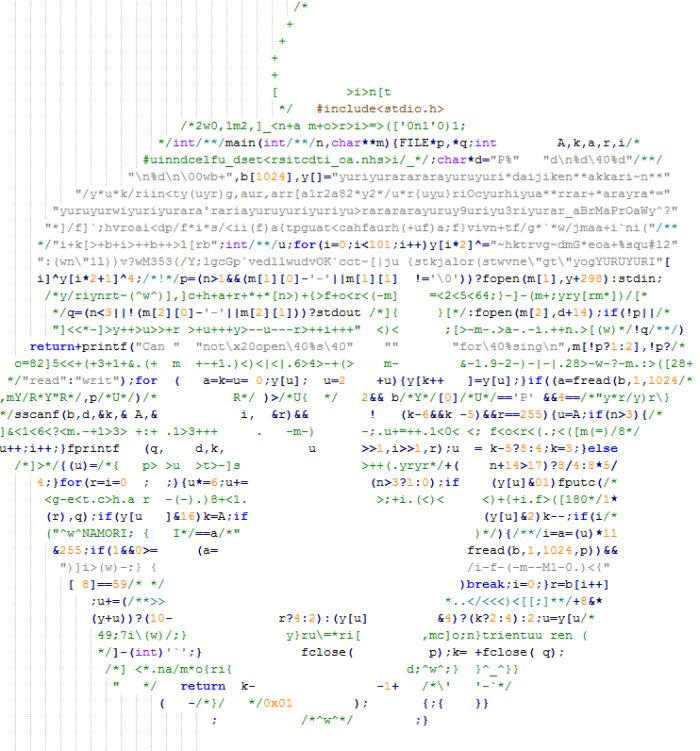

# Clean Code



Кирилл Корняков, Андрей Морозов\
Сентябрь 2014

<!--
TODO
  - Формальные оценки сложности (complexity)
  - Правила от Agile чуваков (типа не надо else...)
  - Кирилл: добавить еще одно понятие
-->

# Содержание

  - Зачем?
  - Ключевые понятия
  - Чистый код
    - Именование
    - Функции/методы
    - Комментарии
    - Форматирование
  - Заключение

# Зачем?

> "Зачем? Наши клиенты не смотрят на исходный код.\
Почему мы должны держать его в чистоте?"

Генеральный директор компании по разработке ПО,\
Нижний Новгород, Август 2010

# Преимущества чистого кода

  - Программист в основном не пишет, а читает код
  - Быстрое понимание кода => быстрое решение задач
     - Добавление новых возможностей
     - Поиск и устранение проблем

# Откуда берется плохой код?

  - Нехватка времени
  - Отсутствие стандартов кодирования
  - Различная квалификация сотрудников
  - Низкая культура (уход от ответственности)
  - Унаследованный / сторонний код

Кто же виноват?

> - Руководство (заказчик, менеджер)
  - Коллеги
  - На самом деле: **Вы**!

# Как результат...


# Содержание

  - Зачем?
  - **Ключевые понятия**
  - Чистый код
    - Именование
    - Функции/методы
    - Комментарии
    - Форматирование
  - Заключение

# Что такое качество кода?


# Признаки качества кода

+-----------------------------------------+----------------------------------------------+
| ## Хорошо                               | ## Плохо                                     |
+-----------------------------------------+----------------------------------------------+
|  - Простой, логичный, понятный          |  - Непонятный, заумный, сложный              |
|  - Чистый, структурированный            |  - Запутанный, шумный, визуально нагруженный |
|  - Краткий, лаконичный                  |  - Длинный, повторяющийся                    |
|  - Единообразный (стилистически единый) |  - Беспорядочный, пестрый                    |
+-----------------------------------------+----------------------------------------------+

# Ключевые понятия

 - Дублирование (Duplication)
 - Шум (Noise)
 - Принцип единой ответственности (Single Responsibility Principle - SRP)
 - Ортогональность (Orthogonality)
 - Уровни абстракции (Levels of abstraction)
 - Единообразие (Uniformity)

# Содержание

  - Зачем?
  - Ключевые понятия
  - Чистый код
    - __Именование__
    - Функции/методы
    - Комментарии
    - Форматирование
  - Заключение

# Важность именования

> Программист не стал выдумывать и назвал детей\
> новый сын(1) и новый сын(2)

# Небрежное именование

Что делает следующий фрагмент?

```java
public List<int[]> getThem() {
  List<int[]> list1 = new ArrayList<int[]>();
  for (int[] x: theList) {
    if (x[0] == 4)
      list1.add(x);
  }
  return list1;
}
```

# Осмысленные имена

А теперь?

```java
public List<int[]> getFlaggedCells() {
  List<int[]> flaggedCells = new ArrayList<int[]>();
  for (int[] cell: gameBoard) {
    if (cell[STATUS_VALUE] == FLAGGED)
      flaggedCells.add(cell);
  }
  return flaggedCells;
}
```
> - Это же игра "Сапер"!

# Следим за уровнем абстракции

``` java
public List<Cell> getFlaggedCells() {
  List<Cell> flaggedCells = new ArrayList<Cell>();

  for (Cell cell: gameBoard) {
    if (cell.isFlagged()) {
      flaggedCells.add(cell);
    }
  }

  return flaggedCells;
}
```

# Сравним...

```java
public List<int[]> getThem() {
  List<int[]> list1 = new ArrayList<int[]>();
  for (int[] x: theList) {
    if (x[0] == 4)
      list1.add(x);
  }
  return list1;
}
```

``` java
public List<Cell> getFlaggedCells() {
  List<Cell> flaggedCells = new ArrayList<Cell>();

  for (Cell cell: gameBoard) {
    if (cell.isFlagged()) {
      flaggedCells.add(cell);
    }
  }

  return flaggedCells;
}
```

# Никакой информации...

``` java
public static Matrix createMatrix(int a1, int a2) {
  // ...
}

public static Matrix createMatrix(int width, int height) {
  // ...
}
```

# Magic numbers

Не используйте их!

``` java
    int dailyPay = hourlyRate * 8;
    double milesWalked = feetWalked / 5280;
    int step = width * 4;
```

Используйте:

> - `WORK_HOURS_PER_DAY`
  - `FEET_PER_MILE`
  - `sizeof(int)`

# Шум!

``` java
public class Part {
  private String m_dsc;
  void setName(String name) {
    m_dsc = name;
  }
}

```
<br><br><br>

``` java
public class Part {
  private String description;
  void setDescription(String description) {
    this.description = description;
  }
}
```

# Одно слово для каждой концепции

> - fetch
  - retrieve
  - get

<br>

> - controller
  - manager
  - driver

<br><br><br>

> - DeviceManager vs ProtocolController

# Имена классов

Имена классов и объектов должны представлять собой существительные и их комбинации:

<font color=green>хорошо</font>:

 - Customer
 - WikiPage
 - Account

<br>

<font color=red>плохо</font>:

 - Manager
 - Processor
 - Data
 - Info

# Имена методов

Имена методов представляют собой глаголы или глагольные словосочетания:

``` java
String name = employee.getName();
customer.setName("Mike");
if (paycheck.isPosted()) ...
```
<br>

<font color=green>хорошо</font>:
``` java
Complex point = Complex.FromRealNumber(23.0);
```

<font color=red>плохо</font>:
``` java
Complex point = new Complex(23.0);
```

# Именование типов

<font color=green>хорошо</font>:

``` java
public class IncompleteOrder {}
public int currentPosition = -1;
const int WORK_HOURS_PER_DAY = 8;
private bool isBlocked // can, is, has
```
<br>
<font color=red>плохо</font>:

``` java
public class incompleteOrder {}
private bool flag;

public const int NUMBEROFCONTEXTS = 10;
private int collectionsize;
private string m_strName;
private byte _array;
List<PECustomerDetailsData> retrieveValidateAndConvertCustomerSpecificDataIntoPresentationEntities() {}


customer.customerName = "Inc";
```

# Итого. Именование

 - Хорошие имена => Самодокументированный код
 - Плохие имена <= Вы не понимаете предметную область вашего приложения

\
Советы

 - Достаточная длина
 - Осмысленное название
 - Легко читаются
 - Быстро ищутся
 - Не содержат шум
 - Не дезинформируют

# Содержание

  - Зачем?
  - **Ключевые понятия**
  - Чистый код
    - Именование
    - Функции/методы
    - Комментарии
    - Форматирование
  - Заключение

# Функции

Какова нормальная длина функции?

// in a completely uncommented 2000 line method

``` c
    {
      {
        while (.. ) {
          if (..){

          }

          for (.. ) {

          }
             .... (just putting in the control flow here, imagine another few hundred ifs)
          if(..) {
                if(..) {
                    if(..) {
                    ...
                    (another few hundred brackets)
                    }
                }
          } //endif
          ...
```

* The endif showed up around line 800)

# Оптимальное количество параметров функции

``` cpp
    int OverlayFlatVideos(int numberOfFlatVideos,
                          int currentFrameIdx,
                          OverlayAllVideosParams^ previewParams,
                          std::vector<bool>& StreamProcessed,
                          std::vector<acvCapture*>& flatVideoReaders,
                          std::vector<double>& fpsFlatVideos,
                          bool sharedReflection,
                          std::vector<CvMat*>& reflectionsFlatToDome,
                          CvSize& fullDomeSize,
                          std::vector<IplImage*>& masks,
                          std::vector<IplImage*>& borderSmoothImage,
                          CvSize& maskSize,
                          IplImage*& imageFullDome,
                          CvMat*& tempRef,
                          double fps,
                          int& numberOfVideoReaders,
                          IplImage*& imageReflected,
                          IplImage*& imageFullDomeCopy,
                          InterpolationMethod inMethod)
```

# Еще пример: WinApi C++

``` cpp
        hThreadArray[i] = CreateThread(
            NULL,                   // default security attributes
            0,                      // use default stack size
            MyThreadFunction,       // thread function name
            pDataArray[i],          // argument to thread function
            0,                      // use default creation flags
            &dwThreadIdArray[i]);   // returns the thread identifier
```
 <br> <br> <br>

``` cpp
    wnd.CreateWnd(hInstance, wcname, NULL, WS_VISIBLE|WS_OVERLAPPEDWINDOW,
        NWin::SRect(NWin::SPoint(CW_USEDEFAULT,CW_USEDEFAULT),
        NWin::SSize(600,400)), NULL,
        LoadMenu(hInstance, resWapp), NULL);
```
# Выходные параметра функции

``` java
    static void GetSupportDocFilePath(out string supportDocFilePath) {
        supportDocFilePath = new ConfigurationHelper().SupportFilePath;
    }

    static string GetSupportDocFilePath() {
        return new ConfigurationHelper().SupportFilePath;
    }
```

# Убийственная сложность

``` c
float _______ ( float number )
{
  long i;
  float x2, y;
  const float threehalfs = 1.5F;

  x2 = number * 0.5F;
  y  = number;
  i  = * ( long * ) &y;                       // evil floating point bit level hacking
  i  = 0x5f3759df - ( i >> 1 );               // what the fuck?
  y  = * ( float * ) &i;
  y  = y * ( threehalfs - ( x2 * y * y ) );   // 1st iteration
//      y  = y * ( threehalfs - ( x2 * y * y ) );   // 2nd iteration, this can be removed
  return y;
}
```

ftp://ftp.idsoftware.com/idstuff/source/quake3-1.32b-source.zip

# Условия

``` java
    if (splitParameters->projectorVideos == nullptr ||
    System::String::IsNullOrEmpty(splitParameters->splitSettings) ||
    splitParameters->projectorWidth <= 0 ||
    splitParameters->projectorHeight <= 0) {}

    if (timer.HasExpired() && !timer.IsRecurrent()) {}
    if (ShouldBeDeleted(timer)) {}

    if(isValid == false) {}
    if(!canEditPrice) {}
```

# Избегайте коды ошибок

``` java
    public void SendShutDown() {
        var handle = GetHandle(device);
        if (handle != DeviceHandle.INVALID) {
            var err = OpenDevice(handle);
            if (err == NULL) {
              //
            }
            else {
              Logger.Log("Can't open device. Error: " + err.ToSting());
            }
        }
        else {
            Logger.Log("Invalid handle for: " +
            device.ToSting());
        }
    }
```

# Решение

``` java
    public void TrySendShutDown() {
        try {
          SendShutDown();
        }
        catch() {
        // ...
      }
    }

    public void SendShutDown() {
      var handle = GetHandle(device);
      OpenDevice(handle);
      //...
    }
```

# Итого.Функции

 - Оптимальная длина функции (1 - экран ~ 25 - 50 строк)
 - Оптимальное кол-во параметров (0 - отлично, 1-2 - хорошо, 3+ - ужасно)
 - 0/1 - выходной параметр
 - Функция должна выполнять только одну операцию.
 Она должна выполнять ее хорошо.
 И ничего другого она делать не должна.

# Содержание

  * Зачем?
  * Ключевые понятия
  * Чистый код
    - наименование
    - функции/методы
    - **коментарии**
    - форматирование
  * Заключение

# Комментарии

    // When I wrote this, only God and I understood what I was doing
    // Now, God only knows

    ...

    // Magic. Do not touch.

    ...

    // sometimes I believe compiler ignores all my comments

    ...

    // I'm sorry.

    ...

    // I am not sure if we need this, but too scared to delete.

``` java
Catch (Exception e) {
    //who cares?
}
```

# Комментарии

**Они полезны?**

  * Неактуальная информация
  * Устаревшие комментарий
  * Избыточный комментарий
  * Запутывающий комментарий
  * Закоментированный код
  * Дезинформация

# Неактуальная информация, Большой header

``` java
    /*---------------------------------------------------------------
    -----------------------
    Created by: NANDA
    Created Date: 01-AUG-2009
    Modified by:
    Procedure Description: Fetches menu items based on the given
    user permission
    Input Parameters: LoginEntry user
    Output Parameters: none
    ----------------------------------------------------------------
    --------------------*/
    public BEMenuList FetchMenuItems(LoginEntity user) {
    ...
    }
```
# Устаревший комментарий

``` java
    ...
    // Gets the login user id
    // Gets the CRM details
    FetchCrmDetails();
    ...
```

# Избыточный комментарий

``` java
    // If the server variable is empty, throw the error message
    if (loginUserId == null)
    {
        throw new Exception("No User Id");
    }
```

# Запутывающий комментарий

``` java
    public void LoadProperties() {
        try
        {
            var propertiesPath = propertiesLocation +
            "/" + PROPERTIES_FILE;
            var propertiesStream = File.Open(propertiesPath);
            loadedProperties.Load(propertiesStream);
        }
        catch (IOException ex) {
            //If file with properties doesn’t exist,
            //default settings are loaded
        }
    }
```

# Закоментированный код

``` java
//#region ShowHyperLink
///// <summary>
///// Show the hyperlink controls
///// </summary>
//private void ShowHyperLink()
//{
//  asphypCreateAccounts.Visible = true;
//  asphypCreateAccounts.NavigateUrl = "CreateAccount.aspx";
//  asphypCreateAccounts.Text = WebConstants.CreateAccountHyperLink;
//  asphypCreateExtUser.Visible = true;
//  asphypCreateExtUser.NavigateUrl = "ManageExternalUsers.aspx";
//  asphypCreateExtUser.Text = WebConstants.ExternalUserHyperLink;
//}
//#endregion
```

# Еще хуже

``` java
asplblAcceptDeclineDate.Text = contractHistoryList[0].AcceptedDate.ToString();
if (contractHistoryList[0].IsMultiple)
{
    asplblMultiplePublish.Text = "Yes";
}
else
{
    asplblMultiplePublish.Text = "No";
}
//if (contractHistoryList[0].IsLegalApprovalRequierd == true)
//{
//  asplblLegalApproval.Text = "Yes";
//}
//else
//{
//  asplblLegalApproval.Text = "No";
//}
asphdnFileGuid.Value = contractHistoryList[0].FileGuid.ToString();
//int contractRefNo = Convert.ToInt32(asphdnFileMasterld.Value.ToString());
//Session(WebConstants.CONTRACT_REF_NO_SESSION_KEY] = contractRefNo;
asptxtReasonForRejection.Text = string.Empty;
```


# Дезинформация

* Never rely on a comment ...

``` java
/**
 * Always returns true.
 */
public boolean isAvailable()
{
    return false;
}
```

# Позволительные комментарии

* Пояснения в **нетривиальных** случаях

``` java
// format matched kk:mm:ss EEE, MMM dd, yyyy
Pattern timeMatcher = Pattern.Compile("\\d*:\\d*:\\d* \\w*, \\w* \\d*, \\d*");
```

* Заметки разработчика (желательно избегать)

``` c
    //TODO: ...
    //FIXME: ...
    //HACK, NOTE, WARNING
```

* API (doxygen)
    - doctest(python)

# Комментарии: резюме

> "Don’t comment bad code — rewrite it!"

B. Kernighan, P. Plauger
The Elements of Programming Style

# Форматирование

# Горизонтальное выравнивание

``` java
customer.CalculateCredit ( fromDate );
customer.CalculateCredit(fromDate , toDate);
if ( IsValid ) i ++
```

``` java
if(customer.IsValid && customer.Credit == 0.0)
position = new Location(position.x + 10, position.y);
return IsValid ? cdd : DateTime.MaxDate;
```

# Вертикальное выравнивание

``` java
using MVCS.Diff4Big.Domain.ImageEntities;
using MVCS.Diff4Big.Domain.Specifications;
namespace MVCS.Diff4Big.Domain.Comparison.FT {
    public class ByteByByte : ITileComparator {
        private readonly LengthBased lengthBased = new LengthBased();
        public IDeltaContainer Compare(IContentTile tile1, IContentTile tile2, ChangeType changeType) {
            var bytesRangeEqualsSpecification = new BytesRangeEquals(tile1.Content);
            var baseResult = lengthBased.Compare(tile1, tile2, changeType);
            if (baseResult != null) return baseResult;
            if (bytesRangeEqualsSpecification.IsSatisfiedBy(tile2.Content)) return null;
            if (changeType == ChangeType.ImageThematicalTile) {
                return new ThematicalTileContainer((ThematicalBig1Tile) tile2.Clone());}
            return new TileContainer((IContentTile) tile2.Clone(), changeType);
        }
    }
}
```

# Вертикальное выравнивание

``` java
using MVCS.Diff4Big.Domain.ImageEntities;
using MVCS.Diff4Big.Domain.Specifications;

namespace MVCS.Diff4Big.Domain.Comparison.FT {

    public class ByteByByte : ITileComparator {
        private readonly LengthBased lengthBased = new LengthBased();

        public IDeltaContainer Compare(IContentTile tile1, IContentTile tile2, ChangeType changeType) {
            var bytesRangeEqualsSpecification = new BytesRangeEquals(tile1.Content);

            var baseResult = lengthBased.Compare(tile1, tile2, changeType);
            if (baseResult != null) return baseResult;

            if (bytesRangeEqualsSpecification.IsSatisfiedBy(tile2.Content)) return null;

            if (changeType == ChangeType.ImageThematicalTile) {
                return new ThematicalTileContainer((ThematicalBig1Tile) tile2.Clone());
            }
            return new TileContainer((IContentTile) tile2.Clone(), changeType);
        }
    }
}
```

# Главное это интерфейс

``` java
  public void do(); // up

  private int i1;   // down
  //..
```

# Рекомендация

``` java
  if (a == 0);
    a++;

  while(a++ != magic_number);
    a = a << 2;
```
<br><br>

``` java
  if (a == 0){
    a++;
  }

  while(a++ != magic_number) {}
    a = a << 2;
```

# Ключевые принципы

 - Не повторяйся. (DRY: Don't repeat yourself)
 - Как можно проще и глупее. (KISS: keep it simple, stupid)
 - Скажите, что вы имеете в виду, просто и прямо. (Say what you mean, simply and
   directly)
 - Пишите понятно — не умничайте. (Write clearly — don't be too clever)
 - Пишите понятно — не жертвуйте ясностью во имя эффективности. (Write clearly —
   don't sacrifice clarity for "efficiency")

# Заключение: Правило бой скаута

> Всегда оставляй лагерь чище, чем ты его нашел.


# Ключевые моменты

 - Некачественный код — окостенение и смерть ПО
 - Качество кода — это __ответственность разработчика__
 - Чистка кода — __непрерывная__ активность
    - Нет смысла делать периодически (нужно делать постоянно)
    - Закладывается в стоимость задачи
 - Обязательная проверка кода __до__ момента интеграции
    - Инспекция кода (peer review)
    - Автоматическая проверка (continuous integration)

# Контрольные вопросы

 1. Ключевые понятия при разговоре о чистоте кода
 1. Рекомендации по поддержанию чистого кода (именование, форматирование)
 1. Комментарии и чистый код
 1. Ключевые принципы

# Спасибо за внимание!

Вопросы?
