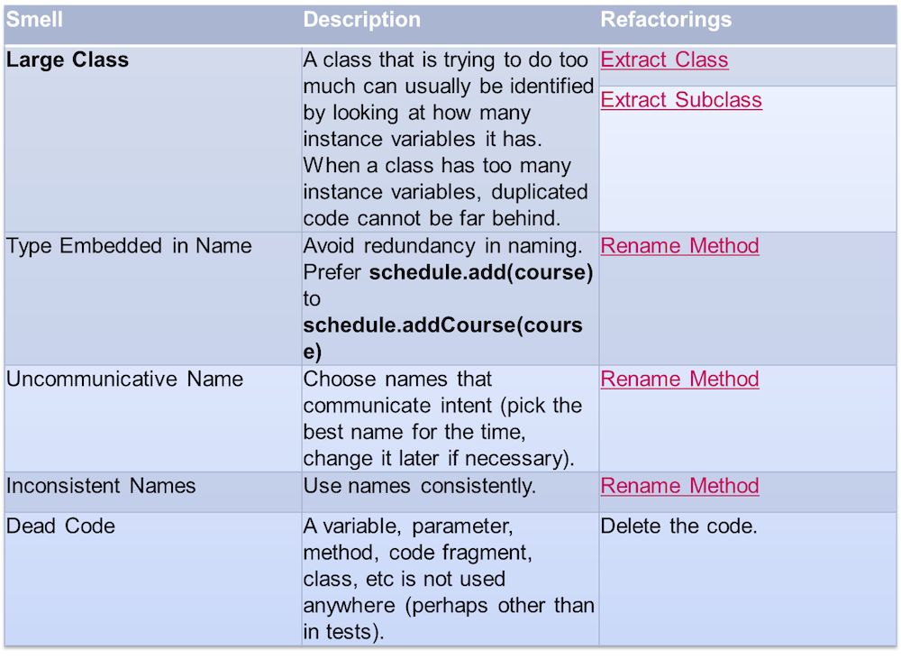

# Рефакторинг


Кирилл Корняков (Itseez, ННГУ)

Октябрь 2015

<!-- TODO
  - Написать контрольные вопросы
  - Подумать насчет живой демонстрации (можно сделать оффлайн)
-->

# Содержание

  - Введение
  - Сode Smells
  - Примеры рефакторингов

# Software Entropy


  - В широком смысле __энтропия__ означает меру неупорядоченности системы
  - В процессе модификации программных систем энтропия возрастает (примеры из жизни)
  - Необходимы осознанные усилия разработчиков, чтобы держать ее под контролем

# Фольклор и метафоры

  - Роберт Мартин: правило бойскаута, уборка посуды
  - Энди Хант и Дейв Томас: теория разбитых окон (из криминологии)
  - Уорд Каннингем: технический долг

# Цель рефакторинга


# Определение рефакторинга

> Изменение внутренней структуры программы\
> без изменений ее видимого поведения\
> с целью облегчить понимание и удешевить модификацию.

М. Фаулер

+------------------------+----------------------+
|||
+------------------------+----------------------+
| Мартин Фаулер          | Кент Бек             |
+------------------------+----------------------+

# Технический долг

+-------------------------------------------------+----------------------+
| - Давление бизнеса                              ||
| - Недостаток процессов или понимания            |                      |
| - Неумение создания слабо связанных компонентов |                      |
| - Недостаток тестов                             |                      |
| - Недостаток документации                       |                      |
| - Недостаток взаимодействия                     |                      |
| - Параллельная разработка                       |                      |
| - Отложенный рефакторинг                        |                      |
| - Нехватка знаний                               |                      |
+-------------------------------------------------+----------------------+

# Сокращение долгов


Все метафоры указывают на необходимость непрерывной работы по поддержанию кода в
чистоте!

# Цели рефакторинга

  - Упростить добавление нового кода
  - Достичь лучшего понимания кода
  - Улучшить дизайн существующего кода

# Процесс рефакторинга

  - Удаление дублирования
  - Упрощение сложной логики
  - Прояснение непонятного кода (Комментариям — Нет!)

# Техника безопасности

  - Кент Бек: "Крупномасштабный рефакторинг — путь к катастрофе"
  - Рефакторинг без автоматических тестов недопустим
  - Не стоит увлекаться
  - Полезная рекомендация: включите рефакторинг в свой рабочий цикл\
    (+20-30%, вспоминаем рабочий цикл TDD)

# Code Smells


# Code Smells



# Разумные причины выполнения рефакторинга

  1. Код повторяется
  1. Метод слишком велик
  1. Цикл слишком велик или вложен в другие циклы
  1. Класс имеет плохую связанность
  1. Интерфейс класса не формирует согласованную абстракцию
  1. Метод принимает слишком много параметров
  1. Отдельные части класса изменяются независимо от остальных частей
  1. При изменении программы требуется параллельно менять несколько классов
  1. Вам приходится параллельно менять несколько иерархий наследования
  1. Родственные элементы данных, используемые вместе, не организованы в классы
  1. Метод использует больше элементов другого класса, чем своего собственного
  1. Элементарный тип данных перегружен

"Совершенный код" С. Макконнелл

# Разумные причины выполнения рефакторинга (2)

  1. Класс имеет слишком ограниченную функциональность
  1. По цепи методов передаются бродячие данные
  1. Объект-посредник ничего не делает
  1. Один класс слишком много знает о другом классе
  1. Метод имеет неудачное имя
  1. Данные-члены сделаны открытыми
  1. Подкласс использует только малую долю методов своих предков
  1. Сложный код объясняется при помощи комментариев
  1. Код содержит глобальные переменные
  1. Перед вызовом метода выполняется подготовительный код (после вызова метода
     выполняется код «уборки»)
  1. Программа содержит код, который может когда-нибудь понадобиться

"Совершенный код" С. Макконнелл

# Refactorings Catalog


# Популярные рефакторинги

  - Rename Method
  - Decompose Conditional
  - Extract Method
  - Extract Class
  - Extract Interface
  - Extract Superclass
  - Move Method

# Unit Tests

``` java
[TestMethod]
public void FetchUsingCreatedBySpecification() {
            var user1 = new User(new Distributor("", "2"));
            var user2 = new User(new Distributor("", "3"));
            var user3 = new User("", "3", Role.Administrator);

            var distributor1 = new Distributor { CreatedBy = user1 };
            var distributor2 = new Distributor { CreatedBy = user2 };
            var distributor3 = new Distributor { CreatedBy = user3 };

            var specification = new CreatedBy<Distributor>(user1);

            Assert.IsTrue(specification.IsSatisfiedBy(distributor1));
            Assert.IsFalse(specification.IsSatisfiedBy(distributor2));
            Assert.IsFalse(specification.IsSatisfiedBy(distributor3));
}
```

# Unit Tests

``` java
[TestMethod]
public void FetchUsingCreatedBySpecification() {
            var john = new User(new Distributor("", "john"));
            var mike = new User(new Distributor("", "mike"));
            var bob = new User("", "bob", Role.Administrator);

            var sonOfJohn = new Distributor {CreatedBy = john};
            var sonOfMike = new Distributor {CreatedBy = mike};
            var daughterOfBob = new Distributor {CreatedBy = bob};

            var createdByJohn = new CreatedBy<Distributor>(john);

            Assert.IsTrue(createdByJohn.IsSatisfiedBy(sonOfJohn));
            Assert.IsFalse(createdByJohn.IsSatisfiedBy(sonOfMike));
            Assert.IsFalse(createdByJohn.IsSatisfiedBy(daughterOfBob));
}
```

# Unit Tests

``` java
new DateTime(2009, 11, 12)

public static DateTime of2009(this double ddMM) {
   var day = (int) Math.Round(ddMM, 0);
   var month = (int) Math.Round(ddMM*100, 0) - day * 100;
   return new DateTime(2009, month, day);
}

12.11.of2009();

```


``` java
var month = new CalendarMonth(2009, 10);

var month = Oct.of2009();

internal static class Oct {
    public static CalendarMonth of2009 {
        get { return new CalendarMonth(2009, 10); }
    }
}
```

# Unit Tests

``` java
var customer = new Customer();
customer.Name = "Vasya Pupkin";
var order = new  Order();
order.Customer = customer;
order.Date = new DateTime(2009, 10, 11);
var orderItem = new orderItem();
orderItem.Product = new Product("Lays");
orderItem.Amount = 3;
orderItem.Price = 45.30;
order.Items.Add(orderItem);
orderItem.Product = new Product("Beer");
orderItem.Amount = 3;
orderItam.Price = 20.50;
order.Items.Add(orderItem)
```

# Unit Tests

``` java
var order = new  OrderBuilder()
    .WithCustomer(“Vasya Pupkin”)
    .WithDate(11.10.of2009())
    .WithLineItem()
        .WithProduct(“Lays”)
        .WithAmount(3)
        .WithPrice(45.30)
    .WithLineItem()
        .WithProduct(“Beer”)
        .WithAmount(3)
        .WithPrice(20.50)
    .GetResult();
```

# Книги

  - Martin Fowler — Refactoring: Improving the Design of Existing Code
  - Joshua Kerievsky — Refactoring to Patterns
  - Martin Fowler — Patterns of Enterprise Application Architecture

# Контрольные вопросы

  1. Определение рефакторинга и его цели.
  1. Понятие технического долга.
  1. Примеры запахов и способы их устранения (3-5 примеров).
  1. Примеры запахов и их связь с принципами SOLID.

# Спасибо!

Вопросы?
