# Scrum

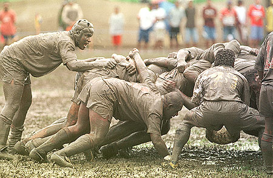

Кирилл Корняков\
Евгений Сорокин

# Содержание

  - Разные модные слова
  - Scrum – что, где, когда?
  - Характеристики
    - Роли
    - Процедуры
    - Артефакты
  - Преимущества Scrum

# Разбираемся с терминами

  - Agile
  - XP
  - Scrum
  - Lean
  - OpenUP
  - Evo
  - RUP
  - Crystal
  - Kanban

# Истоки Scrum

  - Jeff Sutherland (Easel Corp, 1993)
    - IDX and 500+ people doing Scrum
  - Ken Schwaber
    - ADM
    - OOPSLA 96 (Sutherland)
  - Mike Beedle
    - Scrum patterns in PLOPD4
  - Ken Schwaber, Mike Cohn
    - Scrum Alliance (2002)

<!-- TODO:
  - Insert books scans here!!!
-->

# Кто использует Scrum?

+-------------------------------+-----------------------+
| - BBC                         | - **Lockheed Martin** |
| - BMC Software                | - **Microsoft**       |
| - Capital One                 | - Nielsen Media       |
| - Electronic Arts             | - Nokia               |
| - First American Real Estate  | - Oce                 |
| - **Google**                  | - Phillips            |
| - High Moon Studios           | - Sabre               |
| - **Intel**                   | - Salesforce.com      |
| - Intuit                      | - Siemens             |
| - Ipswitch                    | - Time Warner         |
| - John Deere                  | - Turner Broadcasting |
| - Lexis Nexis                 | - **Yahoo**           |
+-------------------------------+-----------------------+

# Для чего использовался Scrum?

+------------------------------------+-------------------------------------------+
| - Commercial software              | - Video game development                  |
| - In-house development             | - FDA-approved, life-critical systems     |
| - Contract development             | - Satellite-control software              |
| - Fixed-price projects             | - Websites                                |
| - Financial applications           | - Handheld software                       |
| - ISO 9001-certified applications  | - Mobile phones                           |
| - Embedded systems                 | - Network switching applications          |
| - 24x7 systems with 99.999% uptime | - ISV applications                        |
|   requirements                     | - Some of the largest applications in use |
+------------------------------------+-------------------------------------------+

# Итеративная разработка

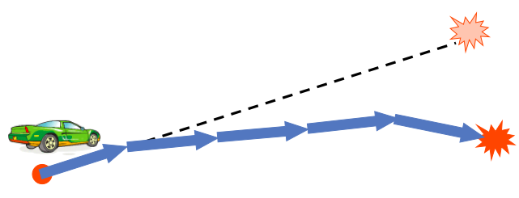

# Инкрементальная разработка

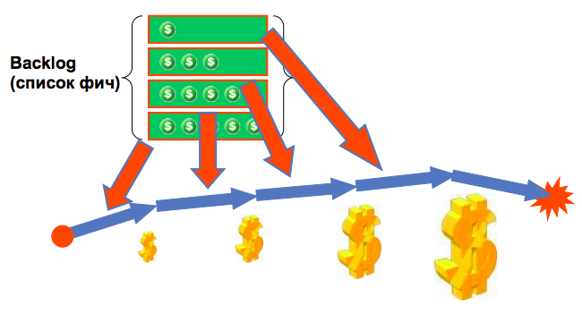

# Жизненный цикл проекта

+----------------------------+----------------+--------------------+
|   Пре-стадия               |   Разработка   |   Релиз            |
+============================+================+====================+
| - Утвердить видение        | Серия спринтов | - Развертывание    |
| - Утвердить финансирование | (итераций)     | - Документирование |
| - Определить требования    |                | - Тренинги         |
| - Создать прототип         |                |                    |
+----------------------------+----------------+--------------------+

# Жизненный цикл спринта

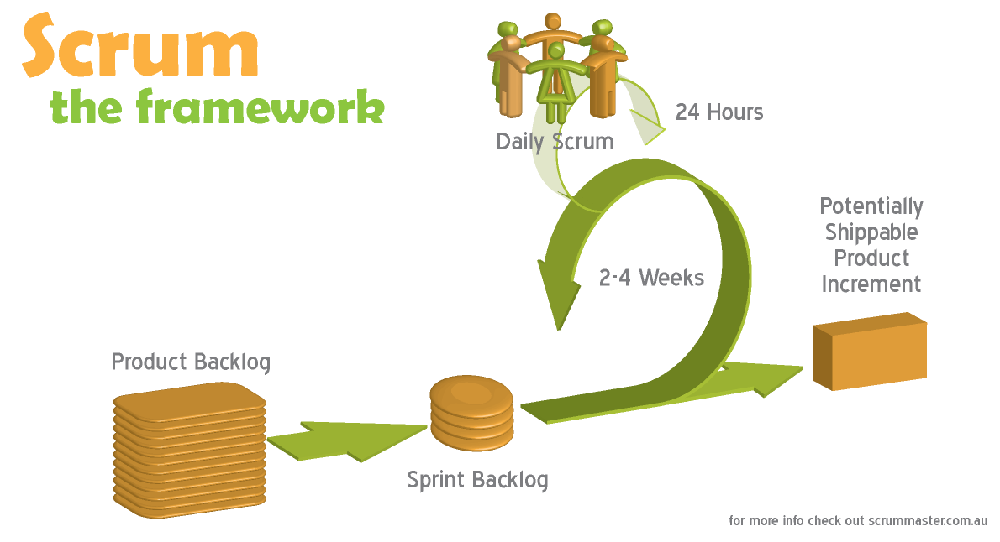

# Production Readiness

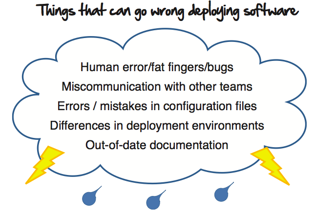

# Scrum framework

  - **Роли**
    - Product owner
    - Scrum master
    - Artifacts
  - Ритуалы
    - Планирование спринтов
    - Ретроспектива
    - Scrum-встречи
  - Артефакты
    - Product backlog
    - Sprint backlog
    - Burndown chart

# Product Owner

  - Концепция, Vision
  - Backlog
  - ROI

**Ответственности**

  - Управление ожиданиями всех заинтересованных лиц
  - Взаимодействие с командой
  - Приемка кода

# Scrum Master

  - Создает атмосферу доверия
  - Модерирует совещания
  - Устраняет препятствия
  - Отвечает за процесс

# Команда

  - 5-9 человек
  - Кросс-функциональные специалисты: (программисты, тестеры, юзабилисты и пр.)
  - Самоорганизующаяся команда
  - Состав не меняется во время спринта

# Scrum framework

  - Роли
    - Product owner
    - Scrum master
    - Artifacts
  - Ритуалы
    - Планирование спринтов
    - Ретроспектива
    - Scrum-встречи
  - Артефакты
    - Product backlog
    - Sprint backlog
    - Burndown chart

# Основные практики Scrum (1)

  - Планирование (на разных уровнях)
  - Длина спринта не более 30 дней
  - Самоорганизующаяся команда
  - Scrum-совещания
  - «Не добавляйте в спринт»
  - Демонстрации продукта

# Основные практики Scrum (2)

  - Решение в течение часа
  - Преграды уходят в течение дня
  - Команда ~7 человек
  - Общая комната (предпочтительно)
  - Ежедневная интеграция (как минимум)
  - Ретроспектива спринта

# Daily Scrum-meetings (standup)

  - Начинать в одно и то же время
  - Длительность не более 15 минут
  - Проводить каждый день
  - Задавать каждому по кругу три вопроса

<!-- TODO: сделать акцент на этой практике -->

# Демонстрация функциональности (Demo)

  - Команда представляет результаты итерации
  - Носит неформальный характер
  - Участники – все stakeholders
  - Product Owner => обратная связь

# Ретроспектива. Анализ процесса

  - Чем занимались в итерацию
  - Плюсы
  - Минусы
  - Идеи
  - План

# Непрерывная интеграция

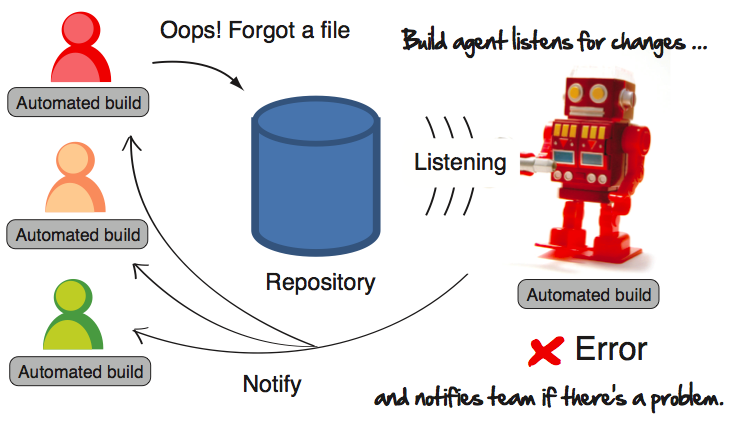

# Scrum framework

  - Роли
    - Product owner
    - Scrum master
    - Artifacts
  - Ритуалы
    - Планирование спринтов
    - Ретроспектива
    - Scrum-встречи
  - Артефакты
    - Product backlog
    - Sprint backlog
    - Burndown chart

# Product backlog

  - Техническое задание
  - Список нужных работ по проекту
  - Объясняет, какой в этом смысл ☺
  - Приоритизирован Product Owner (в каждом спринте)

# Product backlog

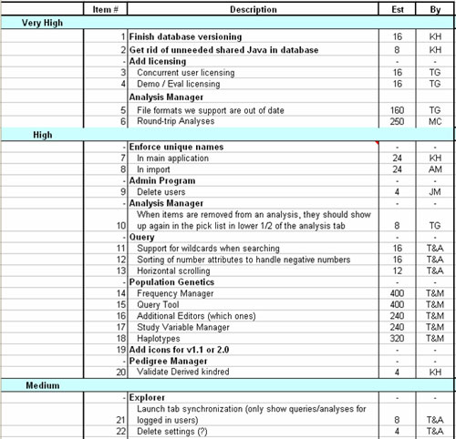

# Sprint Burn Down

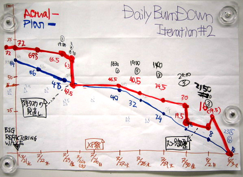

# Итак, что дает Scrum?

  - Гибкость в требованиях
  - Команды лучше
    - Больше ответственности
    - Больше мотивации
    - Выше производительность
    - Выше ROI
  - Прозрачность
    - Прогресс виден ежедневно
    - Проблемы видны ежедневно

# XP + Scrum в Intel

# Парная станция

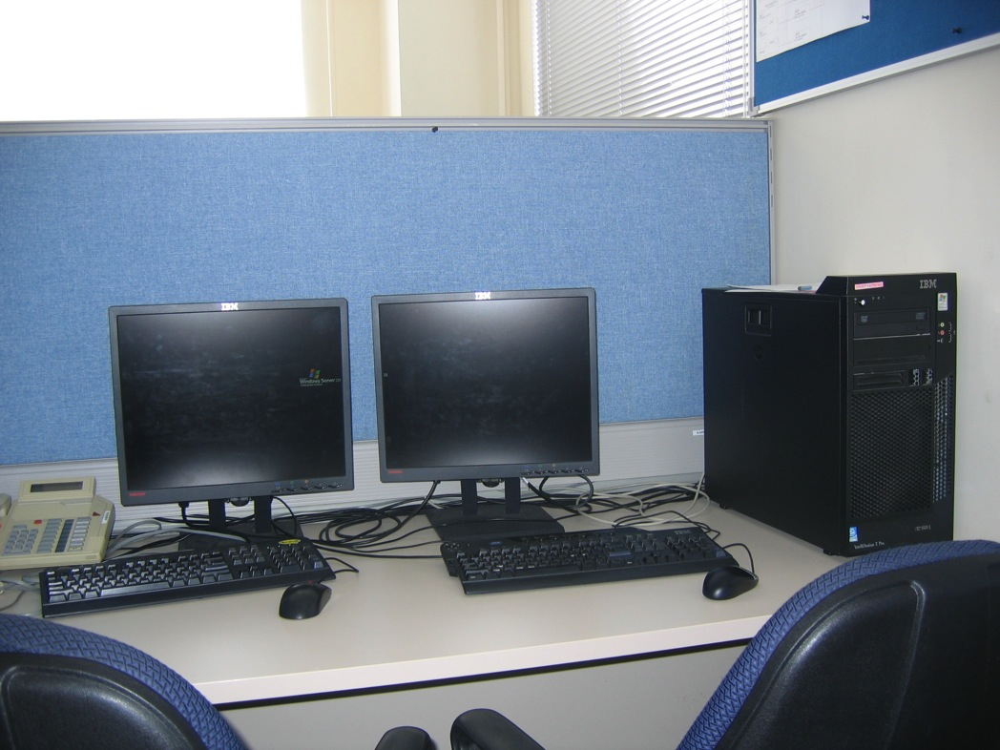

# Наш «производственный цех»

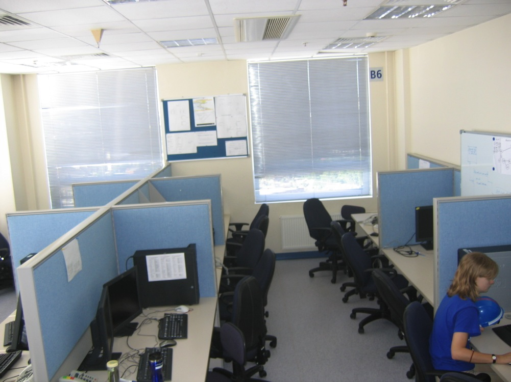

# Scrum-совещание (“Stand-up”)

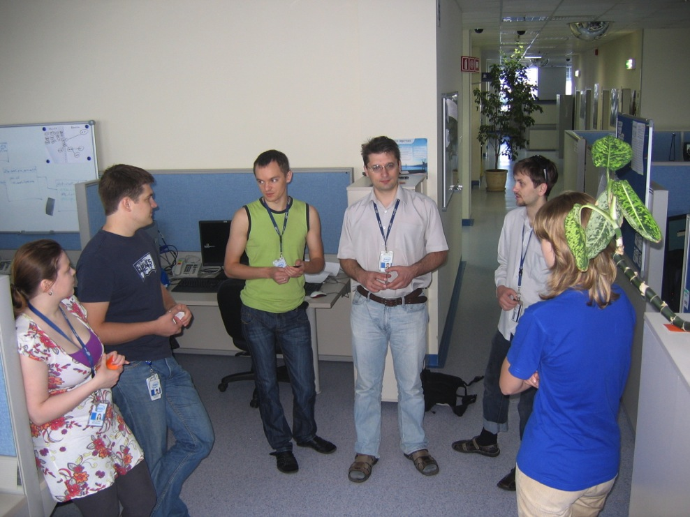

# Task Board

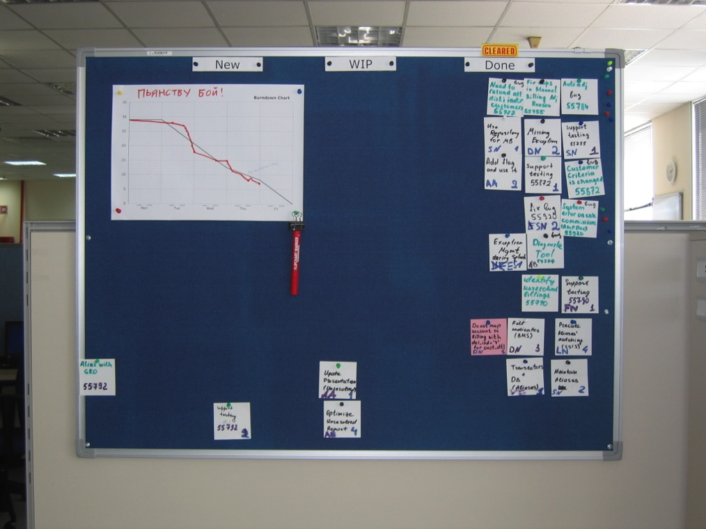

# Burndown Chart

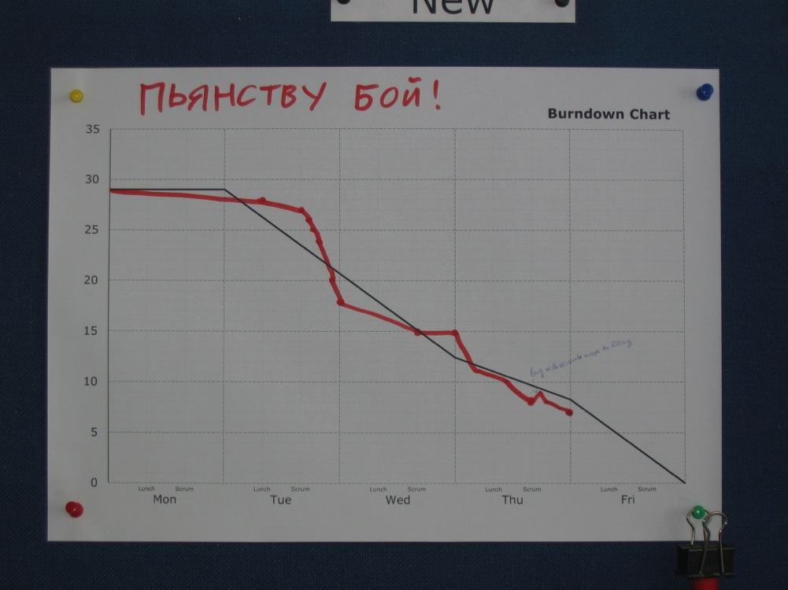

# «Шапка-чекинка»

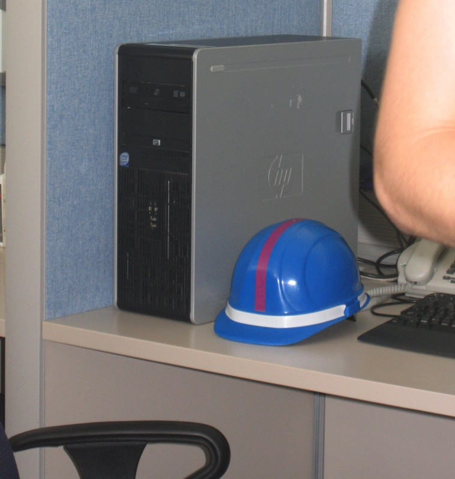

# Карты для планнинг-покера

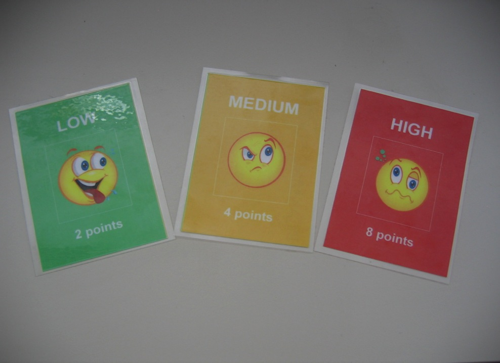

# Спасибо за внимание!
