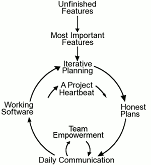
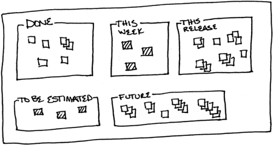
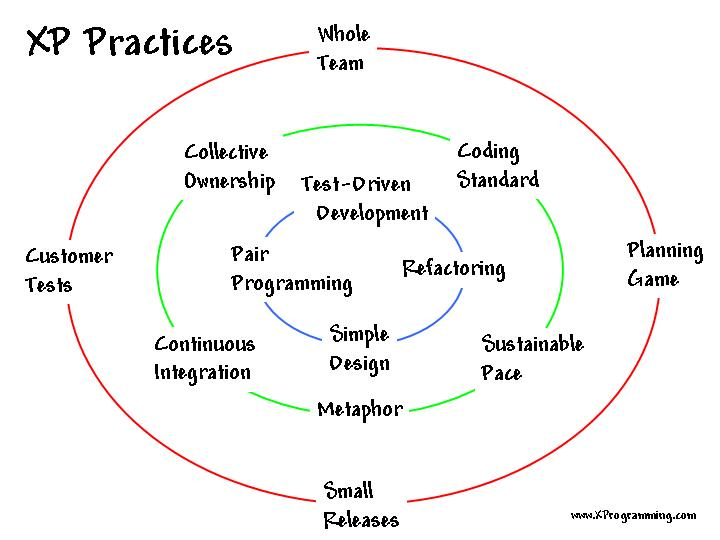
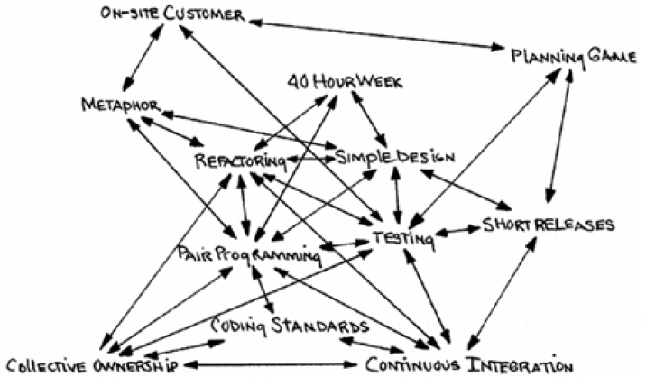

# eXtreme Programming

Кирилл Корняков, Андрей Морозов\
Ноябрь 2014

<!-- TODO
 - Подумать, не стоит ли вернуть стратегии в тело лекции
-->

# Содержание

  1. Основы
  2. Практики
  3. Внедрение

# История

  - Первый XP проект был запущен 6 Марта 1996.
  - В 1999 году опубликована книга Кента Бека _"Extreme Programming Explained:
    Embrace Change"_.
  - Авторы методологии — Кент Бек, Мартин Фаулер, Уорд Каннингем и другие.

# Место XP

> Экстремальное программирование — это __упрощенная__ методика организации
  производства для __небольших и средних по размеру__ команд специалистов,
  занимающихся разработкой программного продукта в условиях __неясных или быстро
  меняющихся__ требований.

Кент Бек

# Решаемые проблемы

  - Смещение графиков
  - Текучка кадров
  - Количество дефектов
  - Недостаток возможностей
  - Потеря полезности/актуальности

Любая из этих проблем может привести к закрытию проекта.

# Ценности ХР

  - Общение
  - Простота
  - Обратная cвязь
  - Смелость
  - Уважение

# Жизненный цикл

[http://www.extremeprogramming.org](http://www.extremeprogramming.org)

# War room

# War room

# War room

# Task board

Обстановка должна быть информативной.

# Практики XP

# Практики XP

  1. __TDD__
  1. __Simple Design__
  1. __Refactoring__
  1. __Pair Programming__
  1. Metaphor
  1. Continuous Integration
  1. Collective Ownership
  1. Coding Standard
  1. Sustainable Pace
  1. Planning Game
  1. Small Releases
  1. Customer Tests
  1. Whole Team

# TDD

  - Весь код должен быть покрыт тестами
  - При обнаружение дефекта создается тест
  - Все тесты должны пройти перед тем как код будет интегрирован
  - После интеграции запускаются приемочные тесты и результат публикуется

# Простой дизайн (*Simple Design*)

  - Добавляйте в дизайн то, что вам нужно, *только тогда*, когда это
    *действительно нужно*!
  - Благодаря постоянной переработке кода вы легко вносите изменения в дизайн
    системы.
  - Простой дизайн *жизненно* важен при дальнейшей модификации системы.

# Рефакторинг (*Refactoring*)

  - Перед добавлением новой возможности программисты спрашивают:
    - Есть ли способ изменения программы, упрощающий добавление новой возможности?
  - После добавления новой возможности задается вопрос:
    - Можно ли теперь упростить программу и обеспечить выполнение всех тестов?
  - Переработав код, вы упрощаете его дальнейшую модернизацию.

# Парное программирование (*Pair Programming*)

# Парное программирование (*Pair Programming*)

  - Абсолютно весь продуктовый код создается в парах.
  - Driver, observer. Observer думает стратегически:
    - Существует ли способ изменить систему так, что текущая проблема просто исчезнет?
    - Сработает ли подход?
    - Есть ли другие тестовые случаи?
  - Преимущества
    - Качество кода
    - Распространение знаний
    - Сфокусированность на задаче

# Парное программирование (*Pair Programming*)

  - Исключения
    - Spike: research, design, exploration and prototyping
    - Не продуктовый код
    - Не код
  - Ликбез
    - \+ Персональные рабочие места
    - Одинаковое рабочее окружение
    - Терпимость

# Практики XP

 1. TDD
 1. Simple Design
 1. Refactoring
 1. Pair Programming
 1. **Metaphor**
 1. **Continuous Integration**
 1. **Collective Ownership**
 1. **Coding Standard**
 1. **Sustainable Pace**
 1. Planning Game
 1. Small Releases
 1. Customer Tests
 1. Whole Team

# Метафора (*Metaphor*)

 - Проект направляется при помощи метафоры.
 - Она помогает понять базовые элементы программы и то, как они взаимосвязаны.
 - Метафора во многом заменяет "архитектуру",\
   она дает сведения о ней в форме, удобной для общения и обдумывания.

# Непрерывная интеграция (*Continuous Integration*)

  - Код интегрируется и тестируется каждые несколько часов, минимум один раз в
    день.
  - Ежедневная сборка проекта — пульс системы!
  - Только одна пара интегрирует код в данный момент времени.
  - Интегрируйтесь чаще.
  - Пара программистов вносит изменения и запускает тесты до тех пор, пока все
    они не сработают на 100%. В противном случае они удаляют свои изменения.

# Коллективное владение (*Collective Ownership*)

  - Любой член команды, который видит возможность добавить что-либо в любой
    раздел кода системы, может сделать это в любой момент времени.
  - Индивидуальное владение приводит к тому, что действительный код системы
    расходится с тем, каким бы его хотел видеть программисты. Код *не
    эволюционирует* с достаточной скоростью.
  - Уход программиста является катастрофой!

# Стандарты кодирования (*Coding Standards*)

  - Код __должен__ быть написан согласно стандарту!
  - Стандарт определяет правила написания кода
  - Аспекты:
    - Форматирование
    - Комментирование (подробность)
    - Специфические моменты для языка программирования
    - Критерии качества кода
  - Стандарт должен способствовать коммуникации, облегчать работу в парах,
    переработку и способствовать созданию простого дизайна.

# 40-часовая рабочая неделя (*Sustainable Pace*)

  - Никто не способен работать по 60 часов в неделю на протяжении многих недель
    и оставаться свежим, творческим, внимательным и уверенным в своих силах.
  - Правило XP — нельзя работать во внеурочное время две недели подряд.
  - Сверхурочные — признак серьезных проблем (не решатся увеличением времени
    работы).
  - _Смертельные марши_ не являются продуктивными, и не производят качественное
    ПО.

# Практики XP

 1. TDD
 1. Simple Design
 1. Refactoring
 1. Pair Programming
 1. Metaphor
 1. Continuous Integration
 1. Collective Ownership
 1. Coding Standard
 1. Sustainable Pace
 1. **Planning Game**
 1. **Small Releases**
 1. **Customer Tests**
 1. **Whole Team**

# Игра в планирование (*Planning Game*)

  - Планирование релизов (roadmap)
    - проект разбивается на итерации
    - пользовательские истории => задачи на итерацию
    - частые релизы
    - планирование происходит перед началом каждой итерации
  - Представители бизнеса определяют:
    - *Объем работ*
    - *Приоритет*
    - *Сроки выпуска версий*
  - Разработчики определяют:
    - *Оценка времени выполнения*
    - *Процесс*
    - *Подробный график работ*
  - Итеративный процесс формулирования и приоритезации задач.

# Небольшие версии (*Small Releases*)

  - Лучше планировать на месяц или два вперед, чем планировать на полгода или
    год вперед.
  - Характеристики
    - Каждая версия должна быть как можно меньше.
    - В ней должны быть реализованы наиболее ценные требования.
    - Версия должна быть логически завершенной и работоспособной.
  - Любая ошибка будет портить жизнь заказчику лишь в течение нескольких недель
    или месяцев, не более того!

# Присутствие заказчика (*On-Site Customer*, *Customer Tests*)

  - Заказчик (пользователь системы) должен находиться с командой для ответов на
    возникающие вопросы, разрешения споров и установки приоритетов — __всегда
    доступен__!
  - Он занимается *написанием функциональных тестов*.
  - При его отсутствии риск резко увеличивается.
  - Программисты пишут модульные тесты, заказчики пишут функциональные
    тесты — их совместная уверенность в надежности системы растет.
    - Нет необходимости в длительном тестированием продукта перед введением его
      в эксплуатацию.

# Полная команда (*Whole Team*)

  - Сидят все вместе + представитель заказчика
  - Кросс-функциональные специалисты
  - Парное программирование => обмен знаниями
  - 40-часовая рабочая неделя
  - Ежедневный stand-up meeting

# Внедрение

  - Всегда нужно идти от реальной проблемы, желательно подкрепленной данными
  - Осваивать ХР с новой командой — непросто, с существующей — еще сложнее
    - Нельзя менять процесс в разгар работы
    - Лучшее время — начало новой итерации
  - Внедрять практики ХР следует по одной
    - Важно помнить про тесную связь методик, половинчатое внедрение может
      навредить.
    - "Fix XP when it breaks".

# Алгоритм внедрения

  1. __Обновите список проблем__, которые мешают проекту быть более успешным
     - Для каждой проблемы оцените потенциальный выигрыш от ее решения
     - Оцените готовность приступить к решению каждой проблемы
  2. __Выберите проблему и спланируйте ее решение__
     - Она должна быть самой приоритетной, но в то же время "решаемой"
     - Составьте список из методик XP, которые будут полезны
     - Помним про взаимосвязь методик
  3. __Решите проблему__, применяя методики ХР
     - Последовательно внедряем отобранные методики
     - Всякий раз отводим одну или несколько итераций, чтобы они "прижились"
  4. Вернитесь на шаг 1

Вся эта работа идеально вкладывается в практику _Ретроспектива_ из Scrum.

# Контрольные вопросы

  1. Определение XP
  1. Круг решаемых проблем
  1. Ценности XP
  1. Жизненный цикл XP проекта
  1. Практики XP
  1. Рабочие окружение
  1. Парное программирование
  1. Внедрение и адаптация

# Спасибо за внимание!

Вопросы?

# Backup

# Planning Strategy

 - __User stories__ are written
 - Make frequent __small releases__
 - __Release planning__ creates the __release schedule__
 - The project is divided into __iterations__
 - __Iteration planning__ starts each iteration

# Managing Strategy

 - Give the team a dedicated __open work space__
 - Set a __sustainable pace__
 - A __stand up meeting__ starts each day
 - __Move people around__
 - __Fix XP__ when it breaks
 - The __Project Velocity__ is measured

# Designing Strategy

 - __Simplicity__ (TUBE)
 - Choose a __system metaphor__
 - Create __spike solutions__ to reduce risk
 - No functionality is __added early__
 - __Refactor__ whenever and wherever possible
 - Use __CRC cards__ for design sessions

# Coding Strategy

 - The customer is __always available__
 - Code must be written to agreed __standards__
 - Use __collective ownership__
 - Code the __unit test first__
 - All production code is __pair programmed__
 - Only one pair __integrates code at a time__
 - __Integrate often__
 - Set up a dedicated __integration computer__

# Testing Strategy

 - All code must have __unit tests__
 - All code must pass all __unit tests__ before it can be released
 - When __a bug is fou__ tests are created
 - __Acceptance tests__ are run often and the score is published
