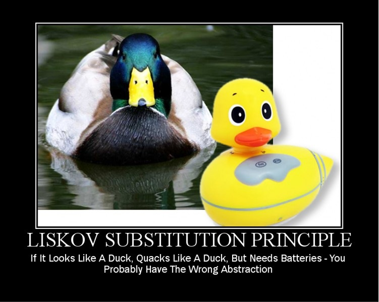

# S.O.L.I.D.

# Признаки "гниющего" кода

* Жесткость (Rigidity)
* Хрупкость (Fragility)
* Неподвижность (Immobility)
* Вязкость (Viscosity)


# Single Responsibility Principle


# Single Responsibility Principle

* Не должно быть больше одной причины для изменения класса

# Пример


# Пример


# Open/Closed Principle

"Программные сущности должны быть открыты для расширения, но закрыты для изменения."

Б. Мейер, 1988 / Р. Мартин, 1996

# Open/Closed Principle


# Пример

``` java
class Car {
  GasEngine engine;
  Car() {
    engine = new GasEngine();
  }
  void Drive() {
    engine.Run();
  }
}
```

``` java
class Car {
  Engine engine;
  Car(Engine engine) {
    this.engine = engine;
  }
  void Drive() {
    engine.Run();
  }
}
```
# Стратегическое закрытие

"Ни одна значительная программа не может быть на 100% закрытой"
Р. Мартин, 1996

# Полезные советы

* Данные не в public полях
* Нет глобальным переменным
* Скрываем неподдерживаемую функциональность
* Проверка типов времени исполнения (RTTI) опасна

# Пример плохого дизайна

``` java
enum OutputDevice {printer, disk};

void Copy(OutputDevice dev) {
    int c;
    while((c = ReadKeyboard())!= EOF)
        if(dev == printer)
            WritePrinter(c);
        else
            WriteDisk(c);
```

``` java
void Copy(Writer writer) {
    int c;
    while ((c = ReadKeyboard()) != EOF) {
        writer.Write(c);
    }
}
```

# Закон Деметры для детей

Ты можешь играть:

 * сам с собой.
 * со своими игрушками, но не разбирать их.
 * с игрушками, которые тебе дали.
 * с игрушками, которые ты сделал сам.

# Liskov Substitution Principle



# Liskov Substitution Principle

"Наследование должно гарантировать, что любое свойство, справедливое для супертипа, должно быть справедливо и для наследников"
Б. Лисков, 1987


# Пример

``` java
class Bird {                  // есть клюв, крылья...
  public virtual void fly();  // птица может летать
};
```

``` java
class Parrot : Bird {     // Попугай – птица
 public override void fly() { ... }
};
```

``` java
class Penguin : Bird {
   public override void fly() {
     error ("Пингвины не летают!"); }
};
```
# Пример

``` java
void PlayWithBird (Bird bird) {
   bird.Fly(); // OK if Parrot.
   // если птица пингвин
   // то будет ай-яй-яй
```
# Пример - решение

``` java
class Bird {
    // есть клюв, крылья...
};

class FlyingBird : Bird {
    public virtual void fly();  // птица может летать
};
```

``` java
class Parrot : FlyingBird {     // Попугай – птица
 public override void fly() { …  }
};
```

``` java
class Penguin : Bird {
    // ...
};
```

# Задача: квадрат – это прямоугольник?

Rectangle:

 * width
 * height
 * SetWidth(double w)
 * SetHeight(double h)
 * GetWidth(double w)
 * GetHeight(double h)

# Interface Segregation Principle


# Interface Segregation Principle

"Клиенты не должны зависеть от интерфейсов, которые они не используют"
Р. Мартин, 1996

# Пример


# Пример


# Dependency Inversion Principle


# Dependency Inversion Principle

Абстракции НЕ должны зависеть от деталей. Детали должны зависеть от абстракций.

# Пример

``` java
void Copy(Writer writer) {
    int c;
    while ((c = ReadKeyboard()) != EOF) {
        writer.Write(c);
    }
}
```

``` java

public interface IReader {
   char Read();
}
public interface IWriter {
   void Write(char c);
}


void Copy(IReader reader, IWriter writer) {
    int c;
    while ((c = reader.Read()) != EOF) {
        writer.Write(c);
    }
}
```

# Procedural vs. OO Architecture

Procedural Architecture 

Object-Oriented Architecture 

# Применяй S.O.L.O.D.!


# Спасибо!

Вопросы?
