# SOLID: Object-Oriented Design Principles

<!-- TODO
  - Можно переупорядочить принципы (например OCP рассказывать после DIP)
  - На месте ли закон Деметера? Привести пример на закон одной точки
  - Object Calisthenics <http://habrahabr.ru/post/206802/>
-->

# Признаки "гниющего" кода

  - Жесткость (Rigidity)
  - Хрупкость (Fragility)
  - Неподвижность (Immobility)
  - Вязкость (Viscosity)

# SOLID principles

  - Single Responsibility Principle
  - Open/Closed Principle
  - Liskov Substitution Principle
  - Interface Segregation Principle
  - Dependency Inversion Principle

# Single Responsibility Principle

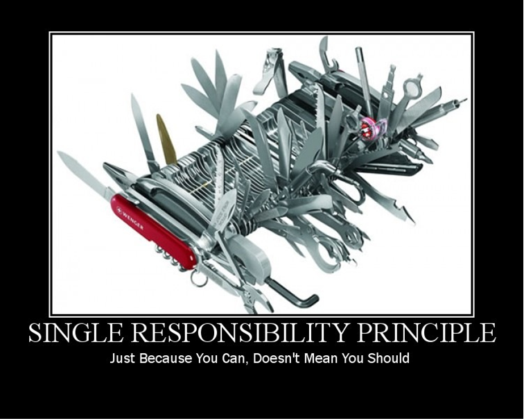

# Single Responsibility Principle

* Не должно быть больше одной причины для изменения класса

# Пример

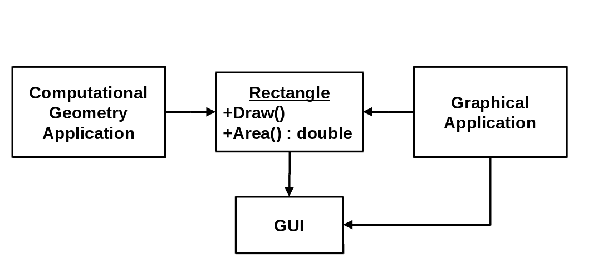

# Пример

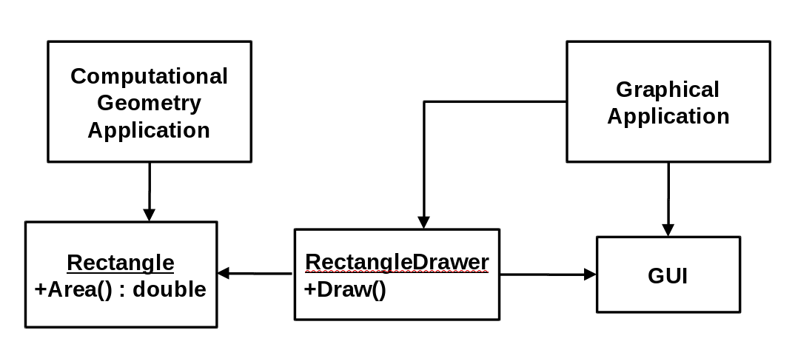

# SOLID principles

  - Single Responsibility Principle
  - <font color=red>Open/Closed Principle</font>
  - Liskov Substitution Principle
  - Interface Segregation Principle
  - Dependency Inversion Principle

# Open/Closed Principle


# Open/Closed Principle

> "Программные сущности должны быть открыты для расширения, но закрыты для
> изменения."

Б. Мейер, 1988 / Р. Мартин, 1996

# Open/Closed Principle

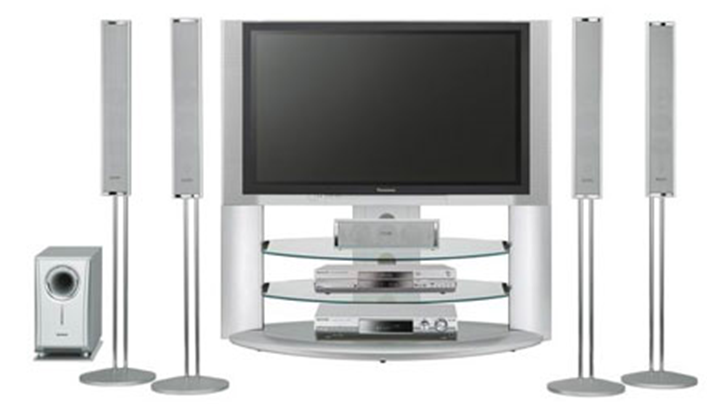

# Пример

Явная зависимость от типа двигателя

``` java
class Car {
  GasEngine engine;
  Car() {
    engine = new GasEngine();
  }
  void Drive() {
    engine.Run();
  }
}
```

Неявная (открытость к расширению без модификации кода)

``` java
class Car {
  Engine engine;
  Car(Engine engine) {
    this.engine = engine;
  }
  void Drive() {
    engine.Run();
  }
}
```

# Стратегическое закрытие

> "Ни одна значительная программа не может быть на 100% закрытой"

Р. Мартин, 1996

# Полезные советы

  - Данные не в public полях
  - Нет глобальным переменным
  - Скрываем неподдерживаемую функциональность
  - Проверка типов времени исполнения (RTTI) опасна

# Пример плохого дизайна

``` java
enum OutputDevice {PRINTER, DISK};

void Copy(OutputDevice device) {
    int c;
    while ((c = ReadKeyboard()) != EOF)
        if (device == PRINTER)
            WritePrinter(c);
        else
            WriteDisk(c);
}
```

Правильный дизайн
``` java
void Copy(Writer writer) {
    int c;
    while ((c = ReadKeyboard()) != EOF) {
        writer.Write(c);
    }
}
```

# Закон Деметера для детей

> - Ты можешь играть:
    - сам с собой
    - со своими игрушками, но не разбирать их
    - с игрушками, которые тебе дали
    - с игрушками, которые ты сделал сам
  - Вопрос: а чего делать нельзя?
  - Закон одной точки

# SOLID principles

  - Single Responsibility Principle
  - Open/Closed Principle
  - <font color=red>Liskov Substitution Principle</font>
  - Interface Segregation Principle
  - Dependency Inversion Principle

# Liskov Substitution Principle

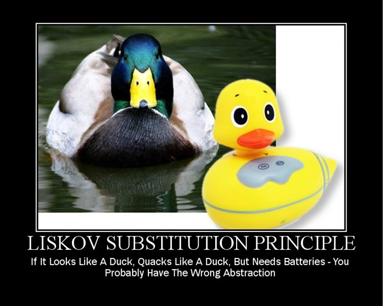

# Liskov Substitution Principle

> "Наследование должно гарантировать, что любое свойство, справедливое для
> супертипа, должно быть справедливо и для наследников"

Б. Лисков, 1987


# Пример

``` java
class Bird {                  // есть клюв, крылья...
    public virtual void fly();  // птица может летать
};
```

``` java
class Parrot : Bird {     // Попугай – птица
    public override void fly() { ... }
};
```

``` java
class Penguin : Bird {
    public override void fly() {
        error ("Пингвины не летают!");
    }
};
```

# Пример

``` java
void PlayWithBird (Bird bird) {
    bird.Fly(); // OK if Parrot.
    // если птица пингвин, то будет ай-яй-яй
```

# Пример - решение

``` java
class Bird {
    // есть клюв, крылья...
};

class FlyingBird : Bird {
    public virtual void fly();  // птица может летать
};
```

``` java
class Parrot : FlyingBird {     // Попугай – летающая птица
 public override void fly() { …  }
};
```

``` java
class Penguin : Bird {
    // ...
};
```

# Задача: квадрат – это прямоугольник?

``` java
class Rectangle {
    private double width;
    private double height;
    public void SetWidth(double w);
    public void SetHeight(double h);
    public double GetWidth();
    public double GetHeight();
}
```

``` java
class Square : Rectangle {...} // Стоит ли так делать?
```

``` java
void g(Rectangle& r)
{
  r.setWidth(5); r.setHeight(4);
  // Какая будет площадь?
}
```

# SOLID principles

  - Single Responsibility Principle
  - Open/Closed Principle
  - Liskov Substitution Principle
  - <font color=red>Interface Segregation Principle</font>
  - Dependency Inversion Principle

# Interface Segregation Principle

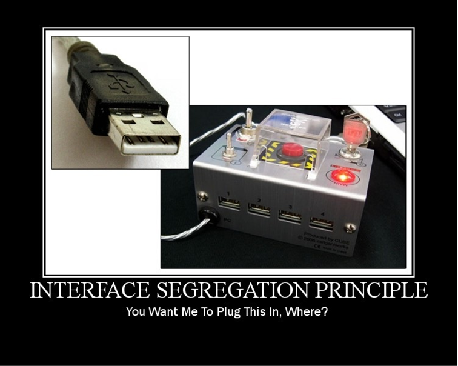

# Interface Segregation Principle

> "Клиенты не должны зависеть от интерфейсов, которые они не используют"

Р. Мартин, 1996

# Пример

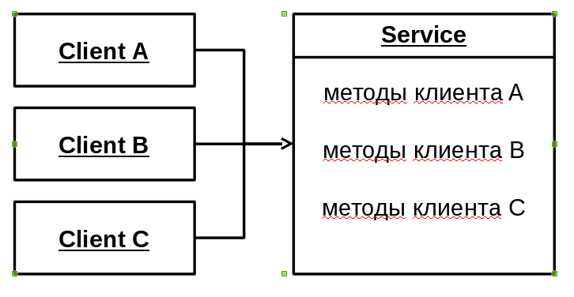

# Пример

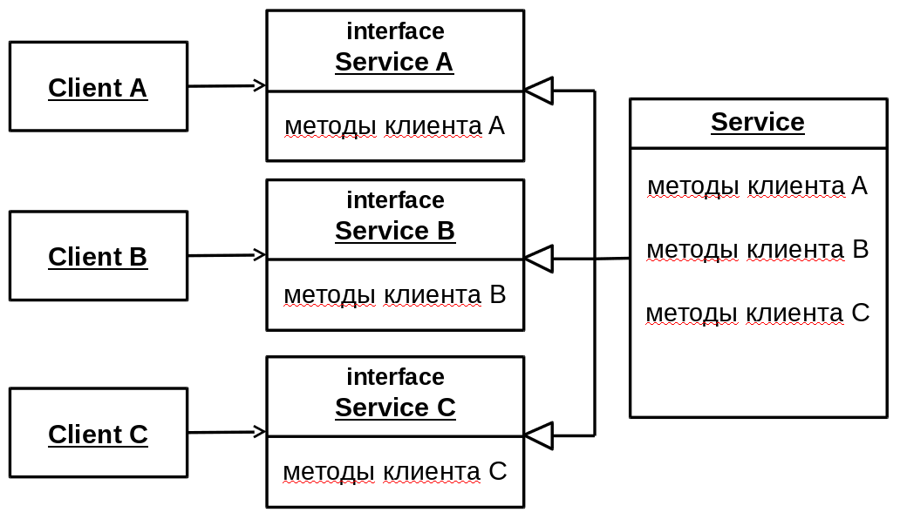

# SOLID principles

  - Single Responsibility Principle
  - Open/Closed Principle
  - Liskov Substitution Principle
  - Interface Segregation Principle
  - <font color=red>Dependency Inversion Principle</font>

# Dependency Inversion Principle

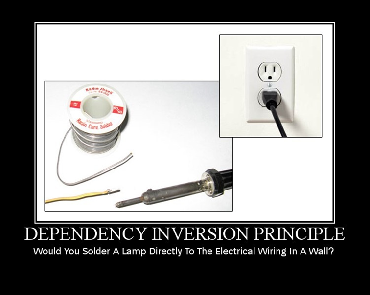

# Dependency Inversion Principle

Абстракции НЕ должны зависеть от деталей. Детали должны зависеть от абстракций.

# Пример

``` java
void Copy(Writer writer) {
    int c;
    while ((c = ReadKeyboard()) != EOF) {
        writer.Write(c);
    }
}
```

``` java

public interface IReader {
   char Read();
}
public interface IWriter {
   void Write(char c);
}

void Copy(IReader reader, IWriter writer) {
    int c;
    while ((c = reader.Read()) != EOF) {
        writer.Write(c);
    }
}
```

# Procedural vs. OO Architecture

Procedural Architecture\
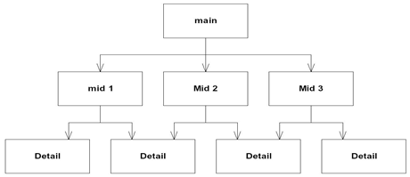

Object-Oriented Architecture\
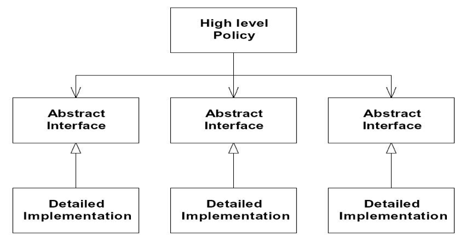

# Применяй S.O.L.I.D.!


# Спасибо!

Вопросы?
