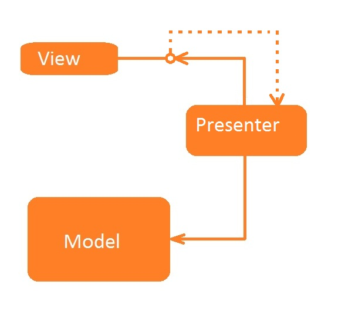
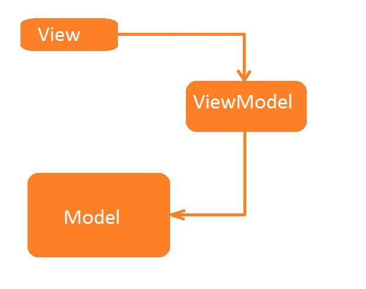
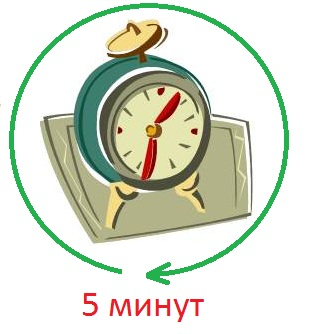

# Дизайн презентационного слоя

Антон Бевзюк (Intel)

# О чем будем говорить
  * Проблемы UI
  * Примеры плохого кода
  * Паттерны Presentation
  * Passive View в деталях
  * Два слова про TDD
  * Демо!

# Болезнь UI

**Слишком много логики:**

  * Ввод данных
  * Представление данных
  * Получение данных
  * События
  * Поведение

# Отвратительный код

# Нарушение SRP

**3+ ответственности у View**

  * Разметка экрана
  * Поведение (реакция на действия пользователя)
  * Получение данных
  * Черт знает что еще

# Что же делать?

#

## Разделять

## Тестировать

# А как?

# Паттерны Presentation
  * Model View Controller
  * Supervising Controller
  * Passive View
  * Model View ViewModel

# Passive View

<!-- Presenter declares an interface for view -->
<!-- View implements this interface -->
<!-- View is injected into Presenter -->
<!-- The goal is to make view passive -->
<!-- Passive View pattern -->
<!-- Presenter is responsible for updating view from model -->
<!-- No dependencies between view and model -->
<!-- Presenter subscribes to view events -->
<!-- View needs to know nothing about presenter and doesn’t need a reference to presenter -->

# Model View ViewModel

# RED/GREEN/REFACTOR
|:--------------|:-------------------------------------------------------|:-------------------------------------------------------|:-------------------------------------------------------|
|**Начало**     |Подумай, напиши тест                                    |Скомпилируй                                             |Исправь ошибки                                          |
|               |Запусти все тесты и убедись, что они прошли |                    |Запусти все тесты и убедись, что они упали |
|               |Рефакторинг                                             |Запусти все тесты и убедись, что они прошли |Напиши код                                 |

# Demo

# Чего мы добились?
  * SRP
  * Увереность (тесты)
  * Повторное использование?

# Спасибо за внимание!

**Антон Бевзюк**\

**anton.bevzjuk@intel.com**