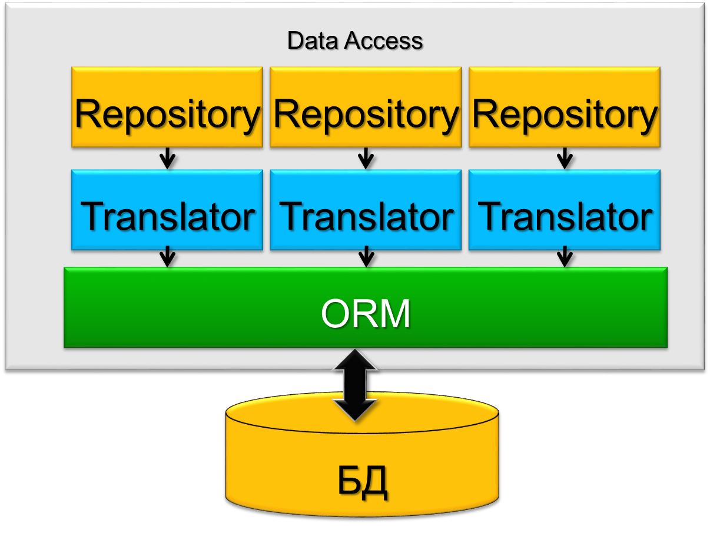

# Data Access

Антон Бевзюк

# Повестка
  - В чем проблема?
  - Разные Data Access’ы
  - Паттерны

# В чем проблема?


# Active Record

```csharp
part = Part.FindFirst("name", "gearbox")
part.Name = "Sample part"
part.Price = 123.45
part.Save()
```

```sql
SELECT * FROM parts WHERE name = 'gearbox'
INSERT INTO parts (name, price) VALUES ('Sample part', 123.45)
```

# Примеры Active Record
  * Castle (.Net)
  * Simple.Data (.Net)
  * ActiveRecord (Ruby)
  * Active JDBC, jOOQ (Java)

# Есть ли жизнь без слоя Data Access?

+----------------------------------------------------+-----------------------------------+
|  * Бизнес-логика зависит от платформы              |  |
|     * Смена технологии – проблема                  |                                   |
|  * Структура данных диктует дизайн бизнес-объектов |                                   |
|     * Плохой дизайн                                |                                   |
|  * Смешение бизнес-логики и логики хранения        |                                   |
|     * Сложно тестировать и сопровождать            |                                   |
+----------------------------------------------------+-----------------------------------+

# А как?

# Data Access-ы бывают разные
  * Прямой доступ
  * Автогенерённые классы
  * Active Record
  * ORM
  * Custom (ручками)

# Прямой доступ

```csharp
var commandText = "SELECT OrderID, CustomerID FROM dbo.Orders;";
using (var connection = new SqlConnection(connectionString)) {
    using (var command = new SqlCommand(commandText, connection)) {
        connection.Open();
        using (var reader = command.ExecuteReader()) {
            while (reader.Read()) {
                // Do something
            }
        }
    }
}
```

# Прокси-классы

```csharp
internal sealed class pr_chnl_prog_geo_get_by_geo {
    internal const string ProcName = "dbo.pr_chnl_prog_geo_get_by_geo";
    private DBCommandWrapper command;

    internal pr_chnl_prog_geo_get_by_geo(Database db) {
        command = db.GetStoredProcCommandWrapper(ProcName);
        command.CommandTimeout = 1800;
        command.AddInParameter("@GeoCode", DbType.AnsiStringFixedLength, "GeoCode", DataRowVersion.Current);
    }

    internal string GeoCode {
        set {
            command.SetParameterValue("@GeoCode", value);
            ((IDataParameter) command.Command.Parameters["@GeoCode"]).SourceColumn = null;
        }
    }

    internal DBCommandWrapper Command {
        get { return command; }
    }
}
```

# ORM - Object-Relational Mapping
  * NHibernate
  * Entity Framework
  * LINQ to SQL
  * etc

# NHibernate


# NHibernate


```xml
<?xml version="1.0" encoding="utf-8" ?>
<hibernate-mapping xmlns="urn:nhibernate-mapping-2.2"
    namespace="QuickStart" assembly="QuickStart">

    <class name="Cat" table="Cat">

        <!-- A 32 hex character is our surrogate key. It's automatically
            generated by NHibernate with the UUID pattern. -->
        <id name="Id">
            <column name="CatId" sql-type="char(32)" not-null="true"/>
            <generator class="uuid.hex" />
        </id>

        <property name="Name">
            <column name="Name" length="16" not-null="true" />
        </property>
        <property name="Sex" />
        <property name="Weight" />
    </class>

</hibernate-mapping>
```

# Пример с NHibernate

```csharp
Cat princess = new Cat();
princess.Name = "Princess";
princess.Sex = 'F';
princess.Weight = 7.4f;

ISession session = NHibernateHelper.GetCurrentSession();
ITransaction tx = session.BeginTransaction();
session.Save(princess);
tx.Commit();
NHibernateHelper.CloseSession();
```

# Паттерны слоя Data Access
  * Identity Map
  * Unit of Work

# Identity Map
  * Связь объект - ID
  * Объекты читаются один раз
  * Производительность
  * Корректное сохранение

# Unit of Work
  * Список объектов
  * Транзакционность
  * Меньше конфликтов при записи
  * Нет частых обращений к БД

# Entity Framework


# Пример с Entity Framework

```csharp
Cat princess = new Cat();
princess.Name = "Princess";
princess.Sex = 'F';
princess.Weight = 7.4f;

var context = new DataContext();
var catDataObject = CatTranslator.Persist(princess);
context.Cats.Add(catDataObject);
context.SaveChanges();
```

# Когда и ORM не спасает...

# Пример структуры Data Access



# Пример с репозиториями

```csharp
var cat = CatRepository.FindByName(“Барсик”);
cat.Eat();
cat.Weight = cat.Weight + 0.5;
cat.Miaow();
CatRepository.Save(cat);
```

# Пример структуры Data Access


# Пример с фасадом

```csharp
var cat = Facade.Get<Cat>( _ => _.Name == “Барсик” );
cat.Eat();
cat.Weight = cat.Weight + 0.5;
cat.Miaow();

Facade.Save(cat);
```

# Роль Data Access


# Резюме
  - Без слоя Data Access плохо
  - Разные подходы
  - Прямой доступ
  - Автосгенерированные классы
  - Active Record
  - ORM
  - Custom
  - Паттерны

# Преимущества Data Access Layer
  - Отделение от бизнес-логики
  - SRP
  - Независимые модели
  - Оптимизация
  - Кеширование
