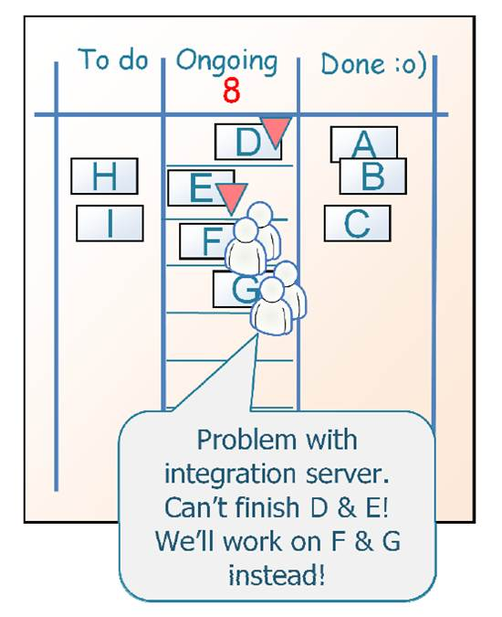
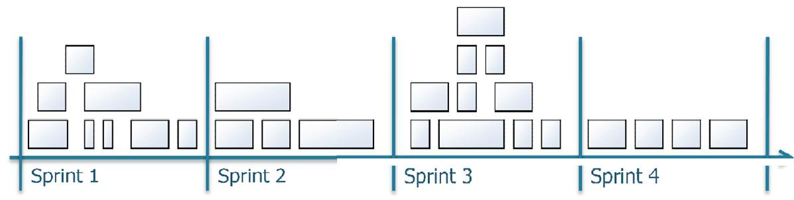
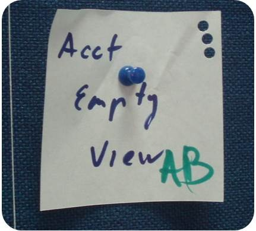
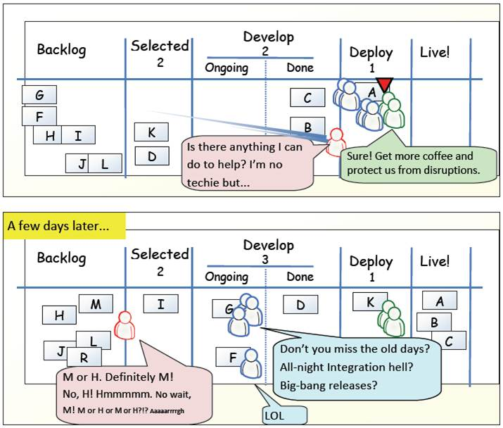

# Kanban

Кирилл Корняков (Intel), Антон Бевзюк (DODO Pizza)\
Ноябрь 2018

# Содержание

  - Истоки
  - Scrum and Kanban
  - Разбор на примере
  - Заключение

# Философия

# Объем методологии

# Toyota Production System

Цель — избавление процесса от:

  1. Перегрузки / стресса (muri)
  1. Несогласованности (mura)
  1. Напрасных потерь (muda)

# Toyota Production System

  1. __Continuous Improvement__
  1. __Respect__ for People
  1. Long-term philosophy
  1. The right process will produce the right results
  1. Add value to the organization by __developing your people and partners__
  1. __Continuously solving root problems__ drives organizational learning

# Kanban

# Распространение

  - Toyota Production System
      - 1948 - 1975
  - Lean Manufacturing
      - 1990s
  - Lean Software Development
      - 2000s

# Содержание

  - Истоки
  - __Scrum and Kanban__
  - Разбор на примере
  - Заключение

# Scrum в двух слайдах (1)

  - Большая группа долго создаёт большую штуку
  - Маленькая группа быстро создаёт маленькую
  - И постоянно интегрируется

# Scrum в двух слайдах (2)

+--------------------+----------------------------+
|  - Backlog         |  |
|  - Iterations      |                            |
|  - Team            |                            |
+--------------------+----------------------------+

# Канбан в трех слайдах (1)

__Практики Канбан__

1. Visualize (the work, workflow and business risks)
1. Limit WIP
1. Manage Flow
1. Make Process Explicit
1. Implement Feedback Loops
1. Improve Collaboratively, Evolve Experimentally (using models & the scientific method)

# Канбан в трех слайдах (2)

__Принципы внедрения Канбан__

  1. Start with what you do now
  1. Agree to pursue incremental evolutionary change
  1. Respect the current process, roles, responsibilities and titles
  1. Leadership at all levels

# Канбан в трех слайдах (3)

__Lead Time —> min__

# Длина итерации

# Ограничение WIP

# Ограничение WIP

+--------------------------------+--------------------------------+
|     |     |
+--------------------------------+--------------------------------+

# Ограничение WIP

+--------------------------------+--------------------------------+
|     |     |
+--------------------------------+--------------------------------+

# Доска

+-----------------------------------+
|        |
+-----------------------------------+
|        |
+-----------------------------------+

# Длительные задачи

+-----------------------------------+
|        |
+-----------------------------------+
|                                   |
+-----------------------------------+
|                                   |
+-----------------------------------+
|                                   |
+-----------------------------------+
|        |
+-----------------------------------+

# Оценки / скорость

# Дырокол и кондуктор

+--------------------------------+--------------------------------+
|     |     |
+--------------------------------+--------------------------------+

# Наша доска

# Оба - Lean & Agile

  - Pull rather than push
  - Kaizen
  - Реагировать на изменения важнее, чем следовать плану

# Сходства

  - Lean & Agile
  - Pull rather than push
  - Ограничение WIP
  - Улучшение процесса
  - Ранние и частые релизы
  - Самоорганизующиеся команды
  - Разбиение работы на части
  - Планирование на основании эмпирических данных

# Отличия

|  __SCRUM__                          | |  __KANBAN__                                           |
|:------------------------------------|-|:------------------------------------------------------|
|                                     | |                                                       |
| Итерации ограничены во времени      | | Итерации не ограничены                                |
|                                     | |                                                       |
| __Команда обязуется сделать__       | | __Обязательства не обязательны__                      |
|                                     | |                                                       |
| Velocity — метрика для планирования | | Lead Time — метрика для планирования                  |
| и улучшения процесса                | | и улучшения процесса                                  |
|                                     | |                                                       |
| __Многофункциональная команда__     | | __Многофункциональная команда не обязательна__        |
|                                     | |                                                       |
| Истории должны помещаться в спринт  | | Нет ограниений на размер истории                      |
|                                     | |                                                       |
| __Burndown chart__                  | | __Не обязательно__                                    |
|                                     | |                                                       |
| Неявное ограничение WIP (на спринт) | | Явное ограничение WIP                                 |
|                                     | |                                                       |
| __Оценки__                          | | __Не обязательно__                                    |
|                                     | |                                                       |
| Backlog фиксирован на спринт        | | Можно добавлять истории в любой момент                |
|                                     | |                                                       |
| __Backlog для одной команды__       | | __Backlog может использоваться несколькими командами__|
|                                     | |                                                       |
| 3 роли                              | | Ролей нет                                             |
|                                     | |                                                       |
| __Доска очищается в конце спринта__ | | __Доска постоянная__                                  |
|                                     | |                                                       |
| Приоритезированный backlog          | | Не обязательно                                        |

# Содержание

  - Истоки
  - Scrum and Kanban
  - __Разбор на примере__
  - Заключение

# Один день из жизни Канбан

# Один день из жизни Канбан

# Один день из жизни Канбан

# Один день из жизни Канбан

# Один день из жизни Канбан

# Один день из жизни Канбан

# Содержание

  - Истоки
  - Scrum and Kanban
  - Разбор на примере
  - __Заключение__

# Инструменты не решают

  - Успешный проект — хороший инструмент
  - Успешный проект — плохой инструмент
  - Провальный проект — плохой инструмент
  - Провальный проект — хороший инструмент

# Выбор инструмента

> "Не привязывайся к одному оружию или стилю"

Миямото Мусаси, самурай, 17 век

# Заключение

  1. Понимайте свои цели
  1. Не вините инструменты
  1. Не ограничивайте себя одним инструментом
  1. Эксперементируйте и наслаждайтесь поездкой

# Контрольные вопросы

  1. Цели TPS
  1. Принципы TPS
  1. Практики Канбан
  1. Принципы внедрения Канбан
  1. В чем смысл ограничения WIP? Приведите примеры того, где это помогает
     оптимизировать процесс.
  1. Назовите сходства Scrum и Kanban
  1. Назовите отличия Scrum и Kanban

# Дополнительные источники

  - [Скрам и Канбан: выжимаем максимум](http://scrum.org.ua/wp-content/uploads/ScrumAndKanbanRuFinal.pdf)

# Спасибо за внимание!

Вопросы?
