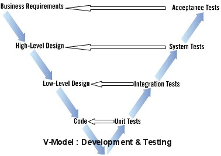

# Agile Software Testing

# Содержание

  - Automated Testing
    - No dedicated testers
    - Unit-testing (evolving into TDD)
    - Infrastructure, System, Acceptance Testing
  - Continuous Integration
    - Code Review (by peers before commit)
    - Automated runs and deploys

# Old-school Testing

  - Преобладает ручное тестирование (ТЗ, тест-планы и т.д.)
  - Тестирование производится после разработки
    - В лучшем случае V-Model

  - Независимые отделы разработки и тестирования (часто разнесены)
    - Поиски оптимального соотношения числа тестировщиков к разработчикам (1:N)

# Недостатки "old-school" подхода

> - Высокая стоимость "перетестирования"
  - Медленная петля обратной связи (иногда просто ее отсутствие)
  - Низкий уровень ответственности, культура конфронтации

Подобная организация практически неприменима в контексте изменяющихся
требований.

# Гибкое тестирование

  - Отсутствие выделенных тестировщиков (кроссфункциональные специалисты)
  - Максимальная автоматизация тестирования
  - Непрерывная интеграция

# Автоматизация тестирования

Несколько уровней тестов:

  - Модульные (переходящие в Test-Driven Development)
  - Инфраструктурные
  - Системные, приемочные тесты

# Анализ качества кода

  - Стиль кодирования
    - Чистый код (именование, форматирование)
    - Анализ сложности
  - Статический анализ
    - Максимальный уровень предупреждений компилятора
    - Специальные инструменты
  - Динамический анализ
    - Утечки памяти, гонки данных
    - Анализ производитесности

# Пример: Google

Книга "How Google Tests Software"

  - Бывшие сотрудники Microsoft, но совершенно иной подход к тестированию
    - Роли с фокусом на тестирование __должны писать код__!
  - TOTT program
  - "Test Certified" Program
