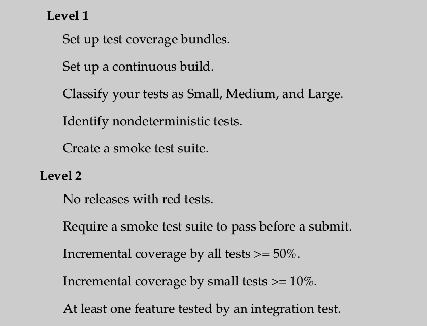
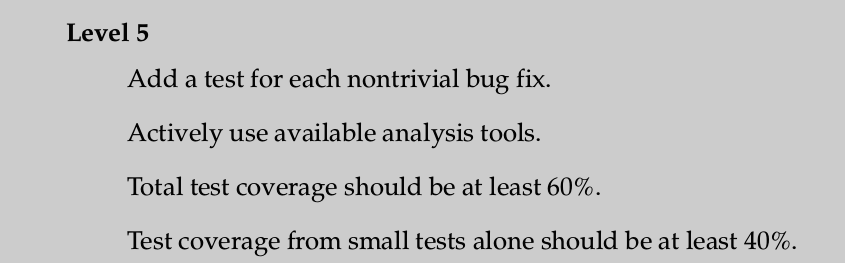

# Agile Software Testing / QA

Кирилл Корняков,\
Динар Ахматнуров

Октябрь 2014

<!-- TODO
  - Automated Testing
    - No dedicated testers
    - Unit-testing (evolving into TDD)
    - Infrastructure, System, Acceptance Testing
  - Continuous Integration
    - Code Review (by peers before commit)
    - Automated runs and deploys
-->

# Содержание

  - Понятие Quality Assurance
  - Традиционный подход к QA
  - Agile подход к тестированию
  - Пример Google
  - Заключение

# Quality Assurance

> - Функциональные требования
    - Наличие возможностей
    - Корректность их работы
  - Нефункциональные требования
    - Производительность
    - Защищенность (security)
    - Надежность / отказоустойчивость (reliability)
    - ...

# Quality Assurance

## "Внутреннее" качество системы

  - Код
    - Стиль, понятность, чистота, и т.д.
  - Объектно-ориентированный дизайн
    - Возможность переиспользования, гибкость, отсутствие дублирований, и т.д.
  - Архитектура
    - Модульность, расширяемость, простота

На нижнем уровне можно делать большое количество проверок автоматически.

На верхних это срабатывает только в частных вопросах.

# Виды тестов

  - Модульные (unit)
    - Индивидуальные функции, методы, классы в изоляции
  - Интеграционные, инфраструктурные
    - Сочетания нескольких классов, использование внешних компонент
  - Системные, функциональные, приемочные (acceptance)
    - Пользовательские сценарии, end-to-end тесты

# Содержание

  - Понятие Quality Assurance
  - __Традиционный подход к QA__
  - Agile подход к тестированию
  - Пример Google
  - Заключение

# Традиционный подход к QA

  - Тестирование производится после разработки
    - В лучшем случае V-Model

  - Независимые отделы разработки и тестирования (часто разнесены)
    - Поиски оптимального соотношения числа тестировщиков к разработчикам (1:N)
  - Преобладает ручное тестирование (Тех. задание, тест-планы и т.д.)
    - Автоматические тесты присутствуют, но создаются не разработчиками

# Тест Джоэла Спольски: 12 шагов к лучшему коду

## Вопрос 10. У вас есть тестеры?

> Если в вашей команде нет тестеров, по крайней мере одного на 2-3х
программистов, вы либо выпускаете продукты, кишащие ошибками, либо теряете
деньги.

> Работа, выполненная программистом, обойдётся вам в 100 $/час, а та же самая
работа, выполненная тестером - 30 $/час.

> Экономия на тестерах - это оскорбительно ложная экономия. Я просто возмущён,
почему большинство людей не замечает этого!

# Недостатки традиционного подхода

> - Высокая стоимость "перетестирования"
  - Медленная петля обратной связи (иногда просто ее отсутствие)
  - Низкий уровень ответственности, культура конфронтации между ролями
  - Подобная организация практически неприменима в контексте изменяющихся
    требований.

# Содержание

  - Понятие Quality Assurance
  - Традиционный подход к QA
  - __Agile подход к тестированию__
  - Пример Google
  - Заключение

# Гибкое тестирование

## Цели

> - Production readiness culture (release in non-event)
  - Уверенность при модификации/развитии системы

## Методы

> - Иной взгляд на соотношение ролей разработчика и тестировщика
  - Максимальная автоматизация тестирования
  - Непрерывная интеграция

# Качество — ответственность разработчика

Именно у разработчика и именно в момент разработки\
есть наилучшее понимание того,\
что может сломаться и что следует тестировать.\
Поэтому он может тестировать хорошо и быстро устранять проблемы.

Примеры: Teleca, Khronos, Google

> - Разработчики обеспечивают покрытие своего кода _модульными_ тестами
  - Покрытие тестами происходит _одновременно_ с разработкой
    - Быстрая обратная связь (vs outsourced testing)
    - Фиксация "инвариантов"
    - Подготовка кода к коллективному владению
  - Важен "агрессивный" стиль тестирования своего кода

# Agile Tester

  - Выделенных тестеров либо совсем нет, либо их очень мало
  - Находятся вместе с остальной командой
  - Люди, ответственные за QA, в основном программируют (!)
    - Интеграционные и системные тесты
    - Поддержание системы непрерывной интеграции

# Автоматизация тестирования

## Полезные практики

  - Огромное количество автоматических тестов
    - Покрытие близко к 100%
    - Количество "тестового" кода сравнимо с "продуктовым" (иногда 3:1)
    - Высокое качество тестового кода
  - Полный прогон модульных тестов должен занимать несколько минут
    - Интеграционные и системные тесты запускаются не реже одного раза в день
  - Test-Driven Development
  - Перед исправлением ошибки создается тест

# Анализ качества кода

  - Стиль кодирования
    - Чистый код (именование, форматирование)
    - Анализ сложности
  - Статический анализ
    - Максимальный уровень предупреждений компилятора
    - Специальные инструменты
  - Динамический анализ
    - Утечки памяти, гонки данных
    - Анализ производительности

# Практика непрерывной интеграции

# Эволюция взглядов на интеграцию

Можно условно представить в виде следующих практик:

> - __Waterfall__: разделить на компоненты, реализовать, интеграция — отдельная фаза
  - __Nightly build__: интегрироваться часто, ночной билд (harthbeet of the project)
  - __Continuous Integration__: интегрироваться непрерывно, тестирование каждого вливания
  - __Pre-commit Testing__: интегрироваться непрерывно, но после проверки стабильности
  - __Continuous Deployment__: развертываться непрерывно, но после проверки стабильности

# Автоматическое развертывание

# Содержание

  - Понятие Quality Assurance
  - Традиционный подход к QA
  - Agile подход к тестированию
  - __Пример Google__
  - Заключение

# Пример: Google

# Пример: Google

Подход к тестированию предложен бывшими сотрудниками Microsoft, однако он
совершенно иной.

> - Инженерные роли
    - Software Engineer (SE)
    - Softwate Engineer in Test (SET)
    - Test Engineer (TE)
  - Основные идеи
    - Платить __одинаковую зарплату__ всем инженерным ролям
    - Роли с фокусом на тестирование __должны писать код__!
  - Корпоративные программы
    - "Testing on the Toilet" program (TOTT)
    - "Test Certified" Program

# Summary of Test Certified Levels

# Summary of Test Certified Levels

# Summary of Test Certified Levels

# Содержание

  - Понятие Quality Assurance
  - Традиционный подход к QA
  - Agile подход к тестированию
  - Пример Google
  - __Заключение__

# Agile vs Traditional QA

# Ключевые моменты

  - Гибкий подход к тестированию позволяет развивать систему контролируемо.
  - Качество — это скорее техника предотвращения ошибок, а не их детектирования.
  - За качество продукта отвечает каждый разработчик.
  - Написание кода и тестирование должны быть неразрывно связаны.

# Контрольные вопросы

  1. Виды автоматических тестов
  1. V-Model разработки ПО
  1. Недостатки традиционного подхода к тестированию
  1. Эволюция взглядов на интеграцию
  1. Ответственность Agile-разработчика за качество
  1. Ответственность Agile-тестировщика
  1. Полезные практики автоматизированного тестирования
  1. Виды автоматического анализа качеста кода

# Спасибо за внимание

Вопросы?
